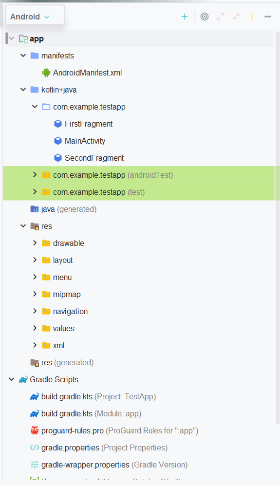

# Buổi 6: Android Overview


## I. Android Overview
### a. Hệ điều hành android và Android Studio
#### 1. Android OS:
- Android là hệ điều hành dựa trên Linux được thiết kế dành cho mobile device có màn hình cảm ứng như điện thoại thông minh và máy tính bảng. Android có mã nguồn mở.
- Ngôn ngữ: Được viết bằng Java, Kotlin (UI), C (nhân), C++ và 1 số ngôn ngữ khác
- Android được phát triển bởi Android Inc. với sự hỗ trợ tài chính từ Google và sau này được chính Google mua lại vào năm 2005.
#### 2. Android Studio:
- Android Studio là IDE chính thức dành cho phát triển nền tảng trên Android.
- Được ra mắt vào ngày 15/03/2013 tại hội nghị Google I/O. Phiên bản ổn định lần đầu được ra mắt vào 12/2024 (p.bản 1.0).
- Được dựa trên phần mềm **Intellij IDEA** của JetBrains. Hỗ trợ các hệ điều hành Windows, Mac OS X và Linux
- Các tính năng nổi bật:
  - Trình giả lập Android (Android Emulator)
  - Build hệ thống với Gradle
  - Công cụ kiểm thử và gỡ lỗi: Logcat, Debugger, Profiler
### b. Android folder project structure - Cấu trúc thư mục dự án Android:
. Cấu hình cơ bản của file:
#### 1. manifests - Thư mục kê khai:
- Chứa file `AndroidManifests.xml`
```xml
<manifest xmlns:android="http://schemas.android.com/apk/res/android"
    package="com.example.myapp">

    <!-- Khai báo quyền sử dụng -->
    <uses-permission android:name="android.permission.INTERNET" />
    <uses-permission android:name="android.permission.CAMERA" />

    <!-- Yêu cầu phiên bản SDK -->
    <uses-sdk
        android:minSdkVersion="21"
        android:targetSdkVersion="33" />

    <application
        android:allowBackup="true"
        android:icon="@mipmap/ic_launcher"
        android:label="@string/app_name"
        android:supportsRtl="true"
        android:theme="@style/Theme.MyApp">

        <!-- Activity khởi động khi mở app -->
        <activity android:name=".MainActivity">
            <intent-filter>
                <action android:name="android.intent.action.MAIN" />
                <category android:name="android.intent.category.LAUNCHER" />
            </intent-filter>
        </activity>

        <!-- Khai báo thêm activity nếu có -->
        <activity android:name=".SecondActivity" />

        <!-- Các service, receiver... nếu có -->
    </application>
</manifest>
```
- Mục đích của manifest:

| Vai trò| Giải thích|
|----| -----|
| **Khai báo app**                     | Định danh tên gói (`package`) và cấu hình ứng dụng.|
| **Khai báo thành phần (components)** | Gồm: `Activity`, `Service`, `BroadcastReceiver`, `ContentProvider`.               |
| **Khai báo quyền (permissions)**     | Quyền như internet, camera, GPS…                                                  |
| **Cấu hình metadata**                | Dành cho cấu hình theme, launcher, thư viện bên ngoài…                            |
| **Chỉ định Intent Filters**          | Xác định các hoạt động nào được khởi chạy từ ngoài (launcher, chia sẻ, mở link…). |

#### 2. Thư mục java hoặc kotlin+java:
- Là thư mục chứa các tệp mã kotlin/java được tạo trong quá trình phát triển ứng dụng. 
- Tự động có 1 file MainActivity.java/kt tự động tạo trong package `com.example.<project name>`

<!-- Tabs -->
<div>
  <button onclick="showCode('java')" style="margin-right: 10px;">Java</button>
  <button onclick="showCode('kotlin')">Kotlin</button>
</div>

<!-- Java Code -->
<pre id="java" style="display: block;"><code class="language-java">
package com.geeksforgeeks.myapplication;

import android.os.Bundle;
import androidx.appcompat.app.AppCompatActivity;

public class MainActivity extends AppCompatActivity {

    @Override
    protected void onCreate(Bundle savedInstanceState)
    {
        super.onCreate(savedInstanceState);
        setContentView(R.layout.activity_main);
    }
}
</code></pre>

<!-- Kotlin Code -->
<pre id="kotlin" style="display: none;"><code class="language-kotlin">
package com.geeksforgeeks.myapplication

    import androidx.appcompat.app.AppCompatActivity import android.os.Bundle

    class MainActivity : AppCompatActivity() {

    override fun onCreate(savedInstanceState: Bundle?)
    {
        super.onCreate(savedInstanceState)
            setContentView(R.layout.activity_main)
    }
}
</code></pre>

<script>
  function showCode(lang) {
    document.getElementById('java').style.display = (lang === 'java') ? 'block' : 'none';
    document.getElementById('kotlin').style.display = (lang === 'kotlin') ? 'block' : 'none';
  }
</script>

### c. XML

### d. Tool cơ bản có trong Android studio

### e. View cơ bản trong Android Studio