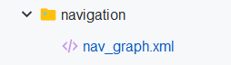
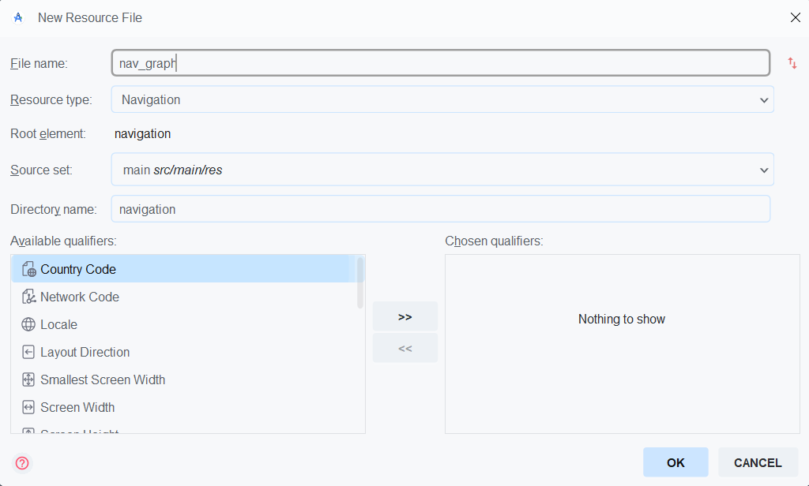
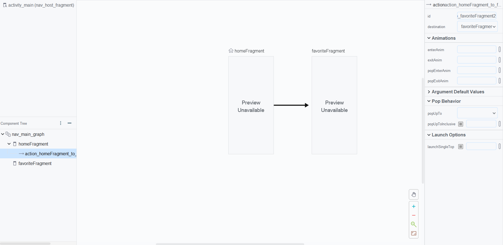
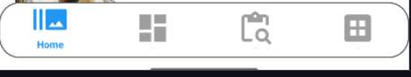
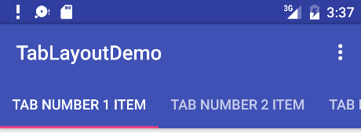

# Buổi 11: Navigation

## I. Lý do có Navigation Component:
- Trước đây, việc quản lý các màn hình (`Fragment` & `Activity`) và luồng điều hướng giữa chúng sẽ khá phức tạp. Ta phải tự quản lý **Backstack** của `Fragment Manager`, xử lý TH xoay màn hình, cấu hình các Intent phức tạp, V.V => Khả năng gặp các lỗi không mong muốn là rất lớn.
- Chính vì thế Android đã cho ra **Navigation Component** của Android Jetpack (2018) để giải quyết vấn đề đó. 
- Nó cung cấp một framework mạnh mẽ, linh hoạt và có cấu trúc để quản lý điều hướng trong ứng dụng của ta, từ các trường hợp đơn giản nhất đến phức tạp nhất. 
- Sử dụng Navigation Component không chỉ giúp mã nguồn sạch hơn, dễ bảo trì hơn mà còn cung cấp các tính năng sẵn có như xử lý Backstack, truyền dữ liệu an toàn, và tích hợp dễ dàng với các thành phần UI phổ biến.
---
## II. Navigation Component và Navigation Graph:
### a. Khái quát
- Ưu điểm của **Navigation Component**
  - **Quản lý Fragment hiệu quả**: Cung cấp công cụ để điều phối và xử lý các tương tác giữa các Fragment một cách thống nhất.
  - **Xử lý hành vi Back hợp lý**: Hỗ trợ quản lý back stack, giúp việc nhấn nút *Back* của người dùng hoạt động trực quan và phù hợp hơn.
  - **Hiệu ứng và chuyển động chuẩn Android**: Có sẵn animation và transition theo guideline của Android, đảm bảo trải nghiệm nhất quán.
  - **Hỗ trợ Deep Linking**: Dễ dàng điều hướng trực tiếp đến một màn hình cụ thể trong ứng dụng thông qua link.
  - **Có sẵn Navigation UI**: Tương thích tốt với các thành phần giao diện có sẵn như *Toolbar*, *Navigation Drawer* và *Bottom Navigation*.
  - **Truyền dữ liệu an toàn với Safe Args**: Cung cấp công cụ giúp truyền dữ liệu giữa các màn hình trong Navigation một cách an toàn và hạn chế lỗi.
  - **Tích hợp tốt với ViewModel**: Hỗ trợ làm việc liền mạch cùng ViewModel, giúp chia sẻ dữ liệu và xử lý logic dễ dàng hơn giữa các màn hình.
---
- Nhược điểm của **Navigation Component**

  * **Học cách sử dụng ban đầu hơi phức tạp**: Với người mới, việc làm quen với *NavHostFragment*, *NavController* và file `navigation.xml` có thể gây khó khăn.
  * **Giới hạn trong tùy biến**: Một số trường hợp đặc thù (custom animation, điều hướng phức tạp) không dễ thực hiện như cách code thủ công.
  * **Phụ thuộc vào AndroidX**: Bắt buộc phải dùng AndroidX, không tương thích ngược với các project cũ chưa migrate.
  * **Sinh thêm boilerplate code**: Khi dùng Safe Args hoặc Navigation UI, có thể tạo ra nhiều code/tệp cấu hình bổ sung.
  * **Khó khăn trong testing**: Việc viết unit test hoặc UI test cho luồng điều hướng đôi khi phức tạp hơn so với cách quản lý Fragment thủ công.
  * **Hiệu năng với project lớn**: Với ứng dụng nhiều màn hình, file `navigation.xml` có thể trở nên cồng kềnh và khó bảo trì.
---
- Bao gồm 3 thành phần chính: **Navigation Graph**, **NavHost** và **NavController**
  - **Navigation Graph** (`nav_graph.xml`): Đây là một tài nguyên XML (hoặc được tạo thông qua trình chỉnh sửa đồ họa trong Android Studio) định nghĩa tất cả các màn hình (được gọi là **destinations**) trong ứng dụng của ta và cách người dùng có thể di chuyển giữa chúng (được gọi là **actions**). Nó cung cấp một cái nhìn trực quan về luồng điều hướng của ứng dụng.
    - **Destinations**: Đây là các màn hình hoặc điểm dừng trong ứng dụng. Thông thường, chúng là các **Fragment**, nhưng cũng có thể là **Activity** hoặc thậm chí là các destination tùy chỉnh.
    - **Actions**: Đây là các kết nối giữa các destinations trong **Navigation Graph**, biểu thị một đường dẫn mà người dùng có thể đi theo. Actions có thể mang theo dữ liệu và có các tùy chọn cấu hình như animation chuyển cảnh hoặc xử lý **Backstack**.
    
  - **NavController**: Đây là đối tượng được sử dụng trong mã nguồn (ví dụ: trong Fragment) để thực hiện các thao tác điều hướng. **NavController** biết **NavHostFragment** của ta và có thể thực hiện các hành động điều hướng được định nghĩa trong **Navigation Graph**.  
    - Một số method quan trọng:
      - `navigate(R.id.destinationId)`: điều hướng đến một màn hình mới.
      - `navigate(R.id.destinationId, bundle)`: điều hướng kèm dữ liệu.
      - `popBackStack()`: quay lại màn hình trước.0 - `navigateUp()`: tương tự nút Back trên thanh Toolbar.
      - `currentDestination`: kiểm tra màn hình hiện tại.
      - `graph`: truy cập Navigation Graph.
    - Cách lấy NavController:
      - Từ **NavHostFragment**:
        - Trong Activity/Fragment, có thể gọi
        ```kotlin
        val navHostFragment = supportFragmentManager
            .findFragmentById(R.id.nav_host_fragment) as NavHostFragment
        val navController = navHostFragment.navController
        ```
      - Từ **findNavController**:
        ```kotlin
        val navController = findNavController(R.id.nav_host_fragment)
        ```
      - Trong Fragment (chỉ dùng khi Fragment nằm trong 1 navHos)
        ```kotlin
        val navController = findNavController()
        ```
  - **Navigation Host**: 
    - `NavHost` là một **container** (vùng chứa) trong giao diện của ứng dụng, nơi mà các *Destination* (Fragment, Activity, Dialog…) sẽ được hiển thị khi điều hướng.
    - Nó giống như một “khung trống”, và khi điều hướng (navigate), `NavController` sẽ thay thế nội dung bên trong `NavHost` bằng `destination` tương ứng.
    - Vai trò:
      - Định nghĩa nơi mà các Fragment sẽ xuất hiện khi người dùng chuyển màn hình.
      - `NavController` là “bộ não” của Navigation (quyết định đi đến đâu). `NavHost` chỉ là “khung hiển thị” cho quyết định đó.
      - Mỗi `NavHost` gắn với một file `navigation.xml` (navigation graph). Graph mô tả tất cả các màn hình và luồng điều hướng.
    - Ví dụ:
    Khai báo **NavHostFragment** trong `activity_main.xml`
    ```xml
    <androidx.fragment.app.FragmentContainerView
    android:id="@+id/nav_host_fragment"
    android:name="androidx.navigation.fragment.NavHostFragment" Xác định NavHost là 1 NavHostFragment
    android:layout_width="match_parent"
    android:layout_height="match_parent"
    app:defaultNavHost="true" Cho phép NavHost này nhận sự kiện Back 
    app:navGraph="@navigation/nav_graph" Gán NavHost với NavGraph/>
    ```
    Liên kết với **NavController**:
    ```kotlin
    val navHostFragment = supportFragmentManager
        .findFragmentById(R.id.nav_host_fragment) as NavHostFragment
    val navController = navHostFragment.navController
    ```
    hoặc
    ```kotlin
    val navController = findNavController(R.id.nav_host_fragment)
    ```

### b. Cách set up dự án dùng Navigation Component: 
#### 1. Thiết lập môi trường và Dependencies:
Trong `build.gradle (project)`:
```kts
plugins {
    // ... các plugin khác
    id("androidx.navigation.safeargs.kotlin") version "2.7.7" apply false // Sử dụng version mới nhất"
}
```

Trong `build.gradle (app)`:
```kts
plugins {
    // ... các plugin khác
    id("androidx.navigation.safeargs.kotlin") //"
}

android {
    // ...
}

dependencies {
    // ... các dependencies khác

    // Navigation Component
    val nav_version = "2.7.7" // Sử dụng version mới nhất

    // Kotlin
    implementation("androidx.navigation:navigation-fragment-ktx:$nav_version")
    implementation("androidx.navigation:navigation-ui-ktx:$nav_version")

    // Nếu cần Navigation Dynamic Features Module
    // implementation("androidx.navigation:navigation-dynamic-features-fragment:$nav_version")

    // Nếu cần Navigation Testing
    // androidTestImplementation("androidx.navigation:navigation-testing:$nav_version")

    // Nếu dùng Jetpack Compose
    // implementation("androidx.navigation:navigation-compose:$nav_version")
}
```
#### 2. Tạo Navigation Graph:
- Tạo 1 thư mục mới nằm trong `res`, đặt tên là `navigation`
- Thêm file `nav_graph.xml` vào thư mục đó


- Hoặc:
  - Chuột phải vào `res`
  - Chọn `Android Resource File`
  - Gõ như trong ảnh:
  

#### 3. Thêm Destinations (Fragments):
Có thể thêm các Fragment (hoặc Activity) hiện có vào graph hoặc tạo Fragment mới trực tiếp từ trình chỉnh sửa graph.

#### 4. Thêm Actions để Nối Các Destinations
- **Actions** xác định các đường dẫn di chuyển giữa các destinations.
- Trong trình chỉnh sửa graph, di chuột qua cạnh phải của destination nguồn (ví dụ: Fragment A).
- Một hình tròn sẽ xuất hiện. Click và kéo hình tròn này đến destination đích (ví dụ: Fragment B).
- Một mũi tên (action) sẽ xuất hiện nối Fragment A với Fragment B.
- Click vào mũi tên này để chọn và cấu hình các thuộc tính của action trong cửa sổ Attributes, ví dụ:
  - Type: Xác định loại destination đích.
  - ID: Một ID duy nhất cho action (được tạo tự động).
  - Arguments: Thêm các đối số cần truyền đi.
  - Options: Cấu hình animation chuyển cảnh (xem thêm về Animation), cách xử lý Backstack (popUpTo, inclusive).
Lặp lại bước này cho tất cả các luồng điều hướng trong ứng dụng.


#### 5. Thêm NavHostFragment vào Layout của Activity
NavHostFragment là nơi các destinations sẽ được hiển thị. ta cần thêm nó vào layout XML của Activity chính của ta (thường là `activity_main.xml`).
```xml
<?xml version="1.0" encoding="utf-8"?>
<androidx.constraintlayout.widget.ConstraintLayout
    xmlns:android="http://schemas.android.com/apk/res/android"
    xmlns:app="http://schemas.android.com/apk/res-auto"
    xmlns:tools="http://schemas.android.com/tools"
    android:layout_width="match_parent"
    android:layout_height="match_parent"
    tools:context=".MainActivity">

    <!-- Đây là NavHostFragment -->
    <androidx.fragment.app.FragmentContainerView
        android:id="@+id/nav_host_fragment"
        android:name="androidx.navigation.fragment.NavHostFragment"
        android:layout_width="0dp"
        android:layout_height="0dp"
        app:layout_constraintBottom_toBottomOf="parent"
        app:layout_constraintLeft_toLeftOf="parent"
        app:layout_constraintRight_toRightOf="parent"
        app:layout_constraintTop_toTopOf="parent"
        app:defaultNavHost="true" // Đảm bảo nó intercept nút Back của hệ thống
        app:navGraph="@navigation/nav_graph" /> <!-- Liên kết với graph đã tạo -->

</androidx.constraintlayout.widget.ConstraintLayout>
```

#### 6. Điều hướng giữa các Destinations với NavController
Bây giờ ta đã có **NavHostFragment** trong Activity và các actions trong Navigation Graph, ta có thể kích hoạt điều hướng từ bất kỳ Fragment nào bên trong **NavHostFragment** đó bằng cách sử dụng NavController.

Trong Fragment nguồn (ví dụ: trong một listener của Button), ta có thể lấy **NavController** và gọi phương thức `navigate()`:
```kotlin
class FragmentA : Fragment(R.layout.fragment_a) {

    override fun onViewCreated(view: View, savedInstanceState: Bundle?) {
        super.onViewCreated(view, savedInstanceState)

        view.findViewById<Button>(R.id.button_go_to_b).setOnClickListener {
            // Tìm NavController
            val navController = findNavController()

            // Thực hiện điều hướng bằng ID của action trong nav_graph
            // R.id.action_fragmentA_to_fragmentB là ID của action ta đã tạo ở Bước 4
            navController.navigate(R.id.action_fragmentA_to_fragmentB)

            // Hoặc, nếu ta sử dụng Safe Args (rất khuyến khích!)
            // val action = FragmentADirections.actionFragmentAToFragmentB()
            // navController.navigate(action)
        }
    }
}
```

#### 7.Truyền dữ liệu giữa các Destination bằng Safe Args

* **Safe Args** là plugin Gradle hỗ trợ truyền dữ liệu giữa các màn hình (destinations) trong Navigation Component một cách **an toàn về kiểu dữ liệu**.
* Nó tự động sinh ra các **lớp Directions và Args** giúp tránh lỗi sai key hoặc sai kiểu khi truyền nhận dữ liệu.

1. **Khai báo Argument trong Navigation Graph** (XML hoặc bằng trình đồ họa):

   * Name: tên tham số (vd: `userId`)
   * Type: kiểu dữ liệu (`String`, `Int`, `Boolean`, `Parcelable`, `Serializable`, …)
   * Nullable: cho phép null hay không
   * Default Value: giá trị mặc định (nếu có)
2. **Sync Gradle** → sinh ra lớp hỗ trợ.
Truyền dữ liệu từ destination nguồn: Sử dụng lớp Directions được tạo bởi Safe Args.
```kotlin
class FragmentA : Fragment(R.layout.fragment_a) {

    override fun onViewCreated(view: View, savedInstanceState: Bundle?) {
        super.onViewCreated(view, savedInstanceState)

        binding.btn_go_to_b.setOnClickListener {
            val userId = 123
            val userName = "Alice"

            // Sử dụng lớp Directions được tạo bởi Safe Args
            val action = FragmentADirections.actionFragmentAToFragmentB(userId, userName)

            findNavController().navigate(action)
        }
    }
}
```
Nhận dữ liệu tại destination đích: Sử dụng lớp Args được tạo bởi Safe Args.
```kotlin
class FragmentB : Fragment(R.layout.fragment_b) {

    override fun onViewCreated(view: View, savedInstanceState: Bundle?) {
        super.onViewCreated(view, savedInstanceState)

        // Sử dụng lớp Args được tạo bởi Safe Args
        val args: FragmentBArgs = FragmentBArgs.fromBundle(requireArguments())

        val userId = args.userId
        val userName = args.userName

        // Sử dụng userId và userName để hiển thị thông tin hoặc tải dữ liệu
        binding.text_user_info.text = "User ID: $userId, Name: $userName"
    }
}
```
#### 8.Xử lý Điều hướng Lên (Up) và Quay lại (Back)
- **Navigation Component** tự động xử lý nút Back của hệ thống dựa trên **Backstack** được quản lý bởi NavController. Khi người dùng nhấn nút Back, **NavController** sẽ tự động pop **destination** hiện tại khỏi **Backstack** và hiển thị **destination** trước đó.

Đối với nút `Up` (mũi tên quay lại trên ActionBar), ta cần kết nối **NavController** với **ActionBar** (hoặc Toolbar). Thư viện **NavigationUI** cung cấp các helper method để làm điều này.

Trong `MainActivity.kt` (hoặc Activity chứa NavHostFragment):
```kotlin
class MainActivity : AppCompatActivity() {

    private lateinit var navController: NavController

    override fun onCreate(savedInstanceState: Bundle?) {
        super.onCreate(savedInstanceState)
        setContentView(R.layout.activity_main)

        // Tìm NavController của NavHostFragment
        val navHostFragment = supportFragmentManager.findFragmentById(R.id.nav_host_fragment) as NavHostFragment
        navController = navHostFragment.navController

        // Kết nối NavController với ActionBar để xử lý nút Up
        setupActionBarWithNavController(navController)
    }

    // Override phương thức này để NavController xử lý sự kiện nút Up
    override fun onSupportNavigateUp(): Boolean {
        return navController.navigateUp() || super.onSupportNavigateUp()
    }
}
```
Hàm `setupActionBarWithNavController(navController)` sẽ hiển thị tiêu đề của destination hiện tại trên ActionBar và tự động hiển thị nút Up khi không ở start destination. Phương thức `onSupportNavigateUp()` cần được override để chuyển tiếp sự kiện nút Up cho **NavController** xử lý.

#### 9. Tích hợp với các UI Khác (Tóm tắt)
- **Navigation Component** được thiết kế để tích hợp dễ dàng với các thành phần UI phổ biến như:
  - `BottomNavigationView`: Bạn có thể liên kết các menu item của **BottomNavigationView** với các destinations trong Navigation Graph. Khi người dùng chọn một item, NavController sẽ tự động điều hướng đến destination tương ứng.
  - `NavigationView` (cho DrawerLayout): Tương tự, bạn có thể liên kết các menu item trong **Drawer Navigation** với các destinations.

Việc tích hợp này thường chỉ yêu cầu một dòng code duy nhất sử dụng các extension function từ thư viện NavigationUI KTX, ví dụ:
```kotlin
// Trong Activity sau khi setup NavController
val bottomNavigationView = findViewById<BottomNavigationView>(R.id.bottom_nav_view)
bottomNavigationView.setupWithNavController(navController)

// Hoặc cho NavigationView trong Drawer
val navView = findViewById<NavigationView>(R.id.nav_view)
navView.setupWithNavController(navController)
```
## II. Các navigation component: Bottom Navigation, Tab Layout + ViewPager2.
### a. Bottom Navigation:

- Dịch nghĩa: Điều hướng ở dưới
- Nó sẽ dùng khi có từ 3 -> 5 navigation
- Các bước tạo **Bottom Navigation**:
  - Tạo `bottom_nav_menu.xml` (để ở folder `menu`): Đây là nơi định nghĩa thanh btNav sẽ có bao nhiêu navigation, có thể đặt tên, id, icon
  ```xml
  <?xml version="1.0" encoding="utf-8"?>
  <menu xmlns:android="http://schemas.android.com/apk/res/android">
      <item
          android:id="@+id/homeFragment"
          android:title="Home"
          android:icon="@drawable/ic_home"/>

      <item
          android:id="@+id/favoriteFragment"
          android:title="Favorite"
          android:icon="@drawable/ic_favorite"/>
  </menu>
  ```
  - Trong `activity_main.xml` thêm:
  ```xml
  <com.google.android.material.bottomnavigation.BottomNavigationView
        android:id="@+id/bottom_nav"
        android:layout_width="match_parent"
        android:layout_height="wrap_content"
        android:background="@color/white"
        app:menu="@menu/bottom_nav_menu_main"
        app:labelVisibilityMode="labeled"
        app:itemRippleColor="@android:color/transparent"
        app:itemIconTint="@color/bottom_nav_color_selector"
        app:itemTextColor="@color/bottom_nav_color_selector"
        app:layout_constraintBottom_toBottomOf="parent"
        app:layout_constraintEnd_toEndOf="parent"
        app:layout_constraintStart_toStartOf="parent" />
  ```
  - Trong `MainActivity.kt` ở phần `onCreate()`:
  ```kotlin
  binding.bottomNav.setOnItemSelectedListener { item ->
      when (item.itemId) {
          R.id.item1 -> {
              // xử lý click item1
              true
          }
          R.id.item2 -> {
              // xử lý click item2
              true
          }
          else -> false
      }
  }
  ```
  hoặc dùng với navController
  ```kotlin
  binding.bottomNav.setupWithNavController(navController)
  ```


### TabLayout:
- **TabLayout** là một thành phần UI cho phép người dùng chuyển đổi giữa các tab (thẻ) khác nhau để truy cập vào các màn hình hoặc chức năng khác nhau trên ứng dụng.
- 1 số thuộc tính của TabLayout:
  - `app:tabMode`: Chế độ hiển thị tab, có thể là fixed hoặc scrollable.
  - `app:tabGravity`: Vị trí hiển thị các tab, có thể là fill hoặc center.
  - `app:tabTextColor`: Màu sắc của chữ trên các tab.
  - `app:tabSelectedTextColor`: Màu sắc của chữ trên tab được chọn.
  - `app:tabIndicatorColor`: Màu sắc của đường chỉ thị trên tab được chọn.



- **ViewPager2** là widget vuốt trang, xây trên RecyclerView => hỗ trợ cập nhật động, DiffUtil, transformer, vertical/horizontal.

- Khi mỗi trang là Fragment => dùng **FragmentStateAdapter**.

- Trang là View thuần => dùng **RecyclerView.Adapter**.
- Ví dụ:
`CategoryPagerAdapter.kt`
```kotlin
package com.example.a011_navigation

import androidx.fragment.app.Fragment
import androidx.viewpager2.adapter.FragmentStateAdapter

class CategoryPagerAdapter(fragment: Fragment) : FragmentStateAdapter(fragment) {
    override fun getItemCount() = 4
    override fun createFragment(position: Int): Fragment = when (position) {
        1 -> CategoryFragment.newInstance(Category.VIET)
        2 -> CategoryFragment.newInstance(Category.TRUNG)
        3 -> CategoryFragment.newInstance(Category.HAN)
        else -> CategoryFragment.newInstance(Category.ALL)
    }
}
```

```kotlin
package com.example.a011_navigation

import android.os.Build
import android.os.Bundle
import android.view.LayoutInflater
import android.view.View
import android.view.ViewGroup
import androidx.fragment.app.Fragment
import androidx.recyclerview.widget.GridLayoutManager
import com.example.a011_navigation.databinding.FragmentCategoryBinding

class CategoryFragment : Fragment() {
    private var _binding: FragmentCategoryBinding? = null
    private val binding get() = _binding!!
    private lateinit var category: Category
    private val adapter = FoodAdapter()

    @Suppress("DEPRECATION")
    override fun onCreate(savedInstanceState: Bundle?) {
        super.onCreate(savedInstanceState)
        if (Build.VERSION.SDK_INT >= Build.VERSION_CODES.TIRAMISU) {
            category = arguments?.getSerializable(ARG_CAT, Category::class.java) ?: Category.ALL
        } else {
            @Suppress("DEPRECATION")
            category = arguments?.getSerializable(ARG_CAT) as Category? ?: Category.ALL
        }
    }

    override fun onCreateView(inflater: LayoutInflater, container: ViewGroup?, savedInstanceState: Bundle?): View {
        _binding = FragmentCategoryBinding.inflate(inflater, container, false)
        return binding.root
    }

    override fun onViewCreated(view: View, savedInstanceState: Bundle?) {
        super.onViewCreated(view, savedInstanceState)
        setupRecyclerView()
        loadCategoryData()
    }

    private fun setupRecyclerView() {
        binding.rvFoods.layoutManager = GridLayoutManager(requireContext(), 2)
        binding.rvFoods.adapter = adapter
    }

    private fun loadCategoryData() {
        adapter.submitList(DemoData.foodsBy(category))
    }

    override fun onDestroyView() {
        super.onDestroyView()
        _binding = null
    }

    companion object {
        private const val ARG_CAT = "arg_category"
        fun newInstance(cat: Category) = CategoryFragment().apply {
            arguments = Bundle().apply { putSerializable(ARG_CAT, cat) }
        }
    }
}
```

## III. Đọc thêm:
### 1. Bottom Sheet
.gif)
Các bước tạo 1 Bottom Sheet:
- Bước 1: Thêm thư viện
  ```bash
  dependencies {
      //Thay X.X.X với version mới nhất
      implementation 'com.android.support:appcompat-v7:X.X.X'
      implementation 'com.android.support:design:X.X.X'
  }
  ```
- Bước 2: Tạo layout trong Bottom Sheet:
  <?xml version="1.0" encoding="utf-8"?>
```xml
<LinearLayout xmlns:android="http://schemas.android.com/apk/res/android"
    xmlns:app="http://schemas.android.com/apk/res-auto"
    android:id="@+id/bottom_sheet"
    android:layout_width="match_parent"
    android:layout_height="340dp"
    android:background="@android:color/darker_gray"
    android:orientation="vertical"
    app:behavior_hideable="true"
    app:behavior_peekHeight="80dp"
    app:layout_behavior="android.support.design.widget.BottomSheetBehavior">

    <TextView
        android:layout_width="match_parent"
        android:layout_height="80dp"
        android:background="@color/colorAccent"
        android:gravity="center"
        android:text="@string/bottom_sheet_peek"
        android:textColor="@android:color/white" />

    <TextView
        android:layout_width="match_parent"
        android:layout_height="match_parent"
        android:gravity="center"
        android:text="@string/bottom_sheet_content"
        android:textColor="@android:color/white" />

</LinearLayout>
```
**behavior_peekHeight:** Xác định chiều cao của phần có thể nhìn thấy.


**behavior_hideable:** Xác định xem Bottom Sheet có thể ẩn bằng cách kéo xuống hay không.
  - Bước 3: Thêm Bottom sheet vào giao diện chính
  ```xml
  <?xml version="1.0" encoding="utf-8"?>
  <android.support.design.widget.CoordinatorLayout xmlns:android="http://schemas.android.com/apk/res/android"
      xmlns:app="http://schemas.android.com/apk/res-auto"
      xmlns:tools="http://schemas.android.com/tools"
      android:layout_width="match_parent"
      android:layout_height="match_parent"
      tools:context="com.androidsample.BottomSheetActivity">

      <!-- include app bar -->
      <include layout="@layout/app_bar" />

      <!-- include main content -->
      <include layout="@layout/activity_bottom_sheet_content" />

      <!-- include bottom sheet -->
      <include layout="@layout/bottom_sheet" />
  </android.support.design.widget.CoordinatorLayout>
  ```

### 2. Data binding:
- DataBinding là cơ chế bind dữ liệu UI trực tiếp trong XML bằng biểu thức, hỗ trợ one-way và two-way binding.
- Khác ViewBinding (chỉ generate class để findViewById an toàn), DataBinding cho phép:
  - Gán giá trị, format, hiển thị/ẩn… ngay trong XML
  - Lắng nghe LiveData tự động (khi set lifecycleOwner)
  - Two-way binding (@={...}) với input

Cách dùng:
Dưới đây là ví dụ tối giản “đưa thông tin **Student** lên màn hình” bằng **Data Binding** (không dùng `binding.tv.setText(...)`):

## a) Bật Data Binding

```gradle
// app/build.gradle
android {
    buildFeatures {
        dataBinding = true
    }
}
```

## b) Model

```kotlin
// Student.kt
package com.example.a011_navigation

data class Student(
    val name: String,
    val age: Int,
    val avatarUrl: String?
)
```

## c) BindingAdapter (load ảnh)

```kotlin
// BindingAdapters.kt
package com.example.a011_navigation

import android.widget.ImageView
import androidx.databinding.BindingAdapter
import com.bumptech.glide.Glide

@BindingAdapter("imageUrl")
fun ImageView.loadImage(url: String?) {
    Glide.with(this).load(url).into(this)
}
```

## d) String resource (format tuổi)

```xml
<!-- res/values/strings.xml -->
<string name="age_format">%1$d tuổi</string>
```

## e) Layout dùng Data Binding

```xml
<!-- res/layout/activity_student.xml -->
<layout xmlns:android="http://schemas.android.com/apk/res/android"
        xmlns:app="http://schemas.android.com/apk/res-auto">
    <data>
        <variable
            name="student"
            type="com.example.a011_navigation.Student" />
    </data>

    <androidx.constraintlayout.widget.ConstraintLayout
        android:layout_width="match_parent"
        android:layout_height="match_parent"
        android:padding="16dp">

        <ImageView
            android:id="@+id/imgAvatar"
            android:layout_width="96dp"
            android:layout_height="96dp"
            app:imageUrl="@{student.avatarUrl}" />

        <TextView
            android:id="@+id/tvName"
            android:layout_width="0dp"
            android:layout_height="wrap_content"
            android:text="@{student.name}" />

        <TextView
            android:id="@+id/tvAge"
            android:layout_width="wrap_content"
            android:layout_height="wrap_content"
            android:text='@{@string/age_format(student.age)}' />

    </androidx.constraintlayout.widget.ConstraintLayout>
</layout>
```

## f) Activity/Fragment gán biến `student`

```kotlin
// StudentActivity.kt
package com.example.a011_navigation

import android.os.Bundle
import androidx.appcompat.app.AppCompatActivity
import com.example.a011_navigation.databinding.ActivityStudentBinding

class StudentActivity : AppCompatActivity() {
    private lateinit var binding: ActivityStudentBinding

    override fun onCreate(savedInstanceState: Bundle?) {
        super.onCreate(savedInstanceState)
        binding = ActivityStudentBinding.inflate(layoutInflater)
        setContentView(binding.root)

        binding.student = Student(
            name = "Nguyễn Hải",
            age = 20,
            avatarUrl = "https://example.com/avatar.png"
        )
    }
}
```
