# Buổi 12: CSDL & MySQL
- [Buổi 12: CSDL \& MySQL](#buổi-12-csdl--mysql)
  - [I. CSDL](#i-csdl)
  - [II. SQL \& MySQL:](#ii-sql--mysql)
    - [b. MySQL:](#b-mysql)
  - [III. Database \& Table trong MySQL:](#iii-database--table-trong-mysql)
    - [a. Database:](#a-database)
    - [b. Table:](#b-table)
  - [IV. Các câu lệnh thao tác với dữ liệu:](#iv-các-câu-lệnh-thao-tác-với-dữ-liệu)
    - [a. INSERT:](#a-insert)
    - [b. UPDATE:](#b-update)
    - [c. DELETE:](#c-delete)
  - [V. Các câu lệnh truy vấn dữ liệu trong MySQL:](#v-các-câu-lệnh-truy-vấn-dữ-liệu-trong-mysql)
    - [1. SELECT](#1-select)
    - [2. WHERE](#2-where)
    - [3. LIMIT](#3-limit)
    - [4. ORDER BY](#4-order-by)
    - [5. GROUP BY](#5-group-by)
    - [6. HAVING](#6-having)
  - [VI. Các loại JOIN:](#vi-các-loại-join)
    - [a. INNER JOIN:](#a-inner-join)
    - [b. LEFT JOIN:](#b-left-join)
    - [c. RIGHT JOIN](#c-right-join)
    - [d. FULL OUTER JOIN](#d-full-outer-join)
    - [e. CROSS JOIN](#e-cross-join)

## I. CSDL

- **CSDL** là **một tập hợp các dữ liệu** có tổ chức **liên quan đến nhau**, thường **được lưu trữ và truy cập** điện tử từ hệ thống máy tính. Khi CSDL phức tạp hơn, chúng thường được phát triển bằng cách sử dụng các kỹ thuật thiết kế và mô hình hóa chính thức.

*Nó giống như 1 thư viện khổng lồ, nơi mà chứa rất nhiều quyển sách được sắp xếp gọn gàng với mã số riêng và ta có thể tìm nó trong vài giây*

- **CSDL quan hệ** tổ chức dữ liệu theo các bảng và có khả năng liên kết với nhau thông qua các khóa.
- Trong **CSDL quan hệ**, các thành phần chính là:
  - **Table: bảng dữ liệu**
    - Đây là thành phần chính trong CSDL quan hệ. Ở bảng dữ liệu sẽ chứa các thông tin như:
     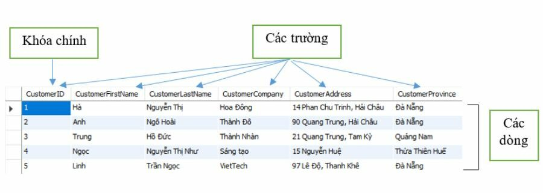
    Với:

       - **Field (Cột/Trường)**: là trường dữ liệu thể hiện các thuộc tính của bảng. Chẳng hạn như: tên, địa chỉ…vv   - **Row (dòng)**: là dòng dữ liệu gồm các thông tin dữ liệu liên quan với nhau gọi là bảng record (bảng ghi).
      - **Cell (ô)**: là các ô giao giữa các dòng và cột là nơi để chứa các dữ liệu.
      - **Primary Key (Khóa chính)**: là một hoặc nhiều trường được gộp lại để định nghĩa bảng ghi. **Không được trùng và cũng không được để trống**. Tức là giá trị 1 của trường customer ID thể hiện cho tất cả dữ liệu của dòng đầu tiên.
  
    *Khóa chính có thể có hoặc không trong bảng nhưng để thuận tiện và dễ dàng quản lý thường người ta sẽ đinh nghĩa khóa chính cho bảng.*
  - **Relationship: mối quan hệ**
    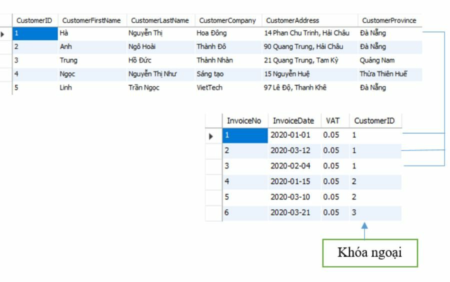
    Thì:
      - **Foreign Key (Khóa ngoại)**: sẽ là trường ở bảng invoice này nhưng lại là khóa chính ở bảng customer kia, tạo nên một mối quan hệ giữa hai bảng với nhau.
      - **Relationship (Mối quan hệ)**: sự kết nối giữa hai bảng để xác định mối liên quan giữa các trường dữ liệu. Cụ thể ví dụ như sau: để biết khách hàng mã số 1 đã mua những đơn hàng nào thì ta cần xác định vào các mối quan hệ trên. 
        **Biểu hiện ở 3 dạng sau:**
        - `Mối quan hệ 1-1`: Mỗi bảng ghi chỉ có một và một bảng tướng ứng mà thôi
        - `Mối quan hệ 1-n`: Mối quan hệ này khá phổ biến trong CSDL. Trong mối quan hệ này thì 1 bảng ghi ở bảng này có thể có nhiều bảng ghi t  
        - ương ứng ở bảng kia.
        - `Mối quan hệ n-n`: Trong mối quan hệ này thì 1 bảng ghi ở bảng 
        - này có thể có nhiều bảng ghi tương ứng ở bảng kia và ngược lại.
        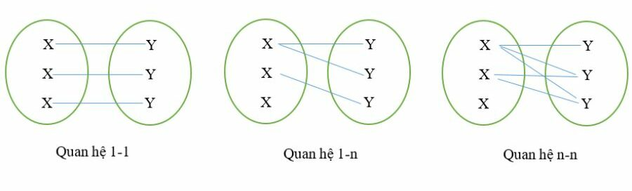
  - **Entity Relationship Diagram: Lược đồ thể hiện mối quan hệ**:
    - **Entity Relationship Diagram (ERD)** là một cách giúp ta hiểu nhanh hơn về cấu trúc và CSDL, dễ dàng thao tác hơn

- - Các loại CSDL:
  - **CSDL quan hệ**: Thường gặp nhất, nó sẽ dùng dạng bảng để lưu trữ ữ liệu và mối quan hệ giữa chúng
  - 
  - **CSDL phi quan hệ (NoSQL)**: Được thiết kế để xử lý khối lượng  dữ liệu phi cấu trúc, như dữ liệu từ mạng xã hội hay các ứng dụng di động. Ví dụ: MongoDB, Cassandra.
  - **CSDL đám mây (Cloud Database)**: Được lưu trữ trên nền tảng đám mây, cho phép truy cập dữ liệu từ bất kỳ đâu có internet. Ví dụ: Google Cloud SQL, Amazon RDS.
  - **CSDL phân tán (Distributed Database)**: Lưu trữ dữ liệu trên nhiều máy chủ khác nhau, giúp tăng cường khả năng chịu tải và dự phòng.

- Các thành phần chính trong CSDL:
  - **Bảng (Table)**: Đây là như là 1 chiếc hộp để chứa dữ liệu, mỗi bảng sẽ là 1 tập hợp các thông tin liên quan
  - **Hàng (Row)**: Mỗi hàng là một bản ghi riêng lẻ trong bảng, chứa thông tin cụ thể về một đối tượng. Ví dụ, một hàng trong bảng “Khách Hàng” sẽ chứa thông tin về một khách hàng cụ thể, như Nguyễn Văn A, sống ở Hà Nội.
  - **Cột (Column)**: Cột là các thuộc tính của dữ liệu. Nếu hàng là một đối tượng, thì cột là những đặc điểm của đối tượng đó. Trong bảng “Khách Hàng”, các cột có thể bao gồm “Tên”, “Địa chỉ”, “Email”.
  - **Khoá Chính (Primary Key)**: Đây là một cột đặc biệt trong bảng, dùng để xác định duy nhất mỗi bản ghi. Khóa chính giống như số chứng minh nhân dân của mỗi người – không ai giống ai.
  - **Hệ Quản Trị CSDL (DBMS)**: Để làm việc với CSDL, ta cần một hệ quản trị CSDL như MySQL, PostgreSQL, Oracle, hay Microsoft SQL Server. DBMS giúp ta tạo ra, quản lý, và vận hành CSDL một cách hiệu quả.
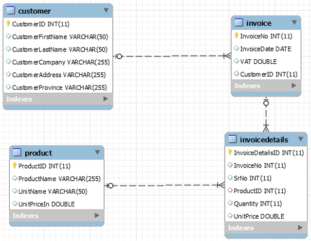

## II. SQL & MySQL:
1 số khái niệm cần nắm trước:
- **CSDL** là tập hợp dữ liệu có cấu trúc được lưu trữ và truy cập từ hệ thống máy tính.
- **Truy vấn CSDL** được hiểu đơn giản là một **bộ lọc** có khả năng thu thập thông tin từ nhiều bảng trong một hệ CSDL và thiết lập các các tiêu chí để hệ quản trị CSDL thích hợp.
### a. SQL:
- **SQL** là viết tắt của **Structured Query Language**, nghĩa là ngôn ngữ truyn CSDL
- Ngôn ngữ SQL là ngôn ngữ chung mà tất cả các hệ thống dữ liệu quan   
- RDBMS) nào g phải đáp ứng. 
- Gồm 2 thành phần:
  - **Bảng SQL**: bao gồm các hàng và cột, tạo ra relationship giữa nhiều bảng dữ liệu đối ưu không gian lưu trữ.
  - **Câu lệnh SQL**: câu lệnh hướng dẫn để hệ thống quản lý CSDL hiểu được.
### b. MySQL:
- **MySQL** là 1 **hệ quản trị CSDL quan hệ (Relational Database Management System - RDBMS)** mã nguồn mở. 
- Nó được dùng để lưu trữ, truy xuất và quản lý dữ liệu trong các website, ứng dụng và hệ thống phần mềm.
- **MySQL** hoặc động theo mô hình **client - server**, khi ấy, máy khách (client) yêu cầu tới máy chủ SQL (SQL server) xử lý và trả về kết quả tương ứng.
- Các quy trình chính diễn ra trong môi trường MySQL đều giống nhau, đó là:
  - **MySQL** tạo CSDL để lưu trữ và thao tác dữ liệu, xác định mối quan hệ của từng bảng.
  - Client có thể đưa ra yêu cầu bằng cách nhập các câu lệnh SQL cụ thể trên MySQL.
  - Server application sẽ phản hồi với thông tin được yêu cầu và nó sẽ xuất hiện ở phía máy khách.
- Ở phía Client, sẽ để ý đến **MySQL GUI** (Giao diện đồ họa người dùng) sử dụng. *GUI càng nhẹ và thân thiện với người dùng, các hoạt động quản lý dữ liệu của họ sẽ nhanh hơn và dễ dàng hơn*. Một số **MySQL GUI** phổ biến nhất là MySQL WorkBench, SequelPro, DBVisualizer và Công cụ quản trị Navicat DB.

## III. Database & Table trong MySQL:
### a. Database:
- Database (cơ sở dữ liệu) là một kho lưu trữ có tổ chức, chứa nhiều bảng (table) để quản lý và truy xuất dữ liệu một cách hiệu quả.
- Cách tạo 1 Database
```sql
CREATE DATABASE [database_name]
```
```SQL
CREATE DATABASE qlsv
```
- Sử dụng từ khóa `IF NOT EXISTS`: Nếu DB đã tồn tại thì hệ thống sẽ báo lỗi
```SQL
CREATE DATABASE qlsv
CREATE DATABASE IF NOT EXISTS qlsv
```
### b. Table:
- Table (bảng) là nơi lưu dữ liệu trong database, theo dạng hàng (row/record) và cột (column/field).

- Cách tạo Table trong MySQL:
```sql
USE [database_name];
CREATE TABLE [table_name](
    <field1> <DATA TYPE> PRIMARY KEY, //Primary key of table
    <field2> <DATA TYPE>,
    <field3> <DATA TYPE>
);
```
Ví dụ
```sql
CREATE TABLE SinhVien (
    MaSV INT PRIMARY KEY AUTO_INCREMENT,
    TenSV VARCHAR(100),
    NgaySinh DATE,
    DiaChi VARCHAR(200)
);
```
nếu muốn thêm dữ liệu tiếng Việt:
```sql
CREATE TABLE SinhVien(
    -- code
) CHARACTER SET utf8mb4 COLLATE utf8mb4_unicode_ci;;
```
- 1 số DATA TYPE: [MySQL Data Types](https://www.w3schools.com/mysql/mysql_datatypes.asp)


## IV. Các câu lệnh thao tác với dữ liệu:
### a. INSERT:
- Thêm dữ liệu mới vào bảng trong CSDL.
- Cú pháp:
```SQL
INSERT INTO [table_name] (column1, column2)
VALUES (value1_a, value2_a),
       (value1_b, value2_b);
```

### b. UPDATE:
- Dùng để thay đổi giá trị của dữ liệu trong bảng.
- Nếu không có WHERE, toàn bộ dữ liệu trong bảng sẽ bị cập nhật.

```sql
UPDATE [table_name]
SET column1 = value1, column2 = value2
WHERE condition;
```

Ví dụ:

```sql
-- Đổi địa chỉ của sinh viên có MaSV = 1
UPDATE SinhVien
SET DiaChi = 'Đà Nẵng'
WHERE MaSV = 1;

-- Cộng thêm 1 tín chỉ cho tất cả các môn học có SoTinChi < 3
UPDATE MonHoc
SET SoTinChi = SoTinChi + 1
WHERE SoTinChi < 3;
```

### c. DELETE:
- Dùng để xóa dữ liệu trong bảng.
- Nếu không có WHERE, toàn bộ dữ liệu sẽ bị xóa sạch.
- Cú pháp:
```sql
DELETE FROM [table_name]
WHERE condition;
```
Ví dụ:
```sql
-- Xóa sinh viên có MaSV = 2
DELETE FROM SinhVien
WHERE MaSV = 2;

-- Xóa tất cả các môn học có số tín chỉ nhỏ hơn 2
DELETE FROM MonHoc
WHERE SoTinChi < 2;
```

## V. Các câu lệnh truy vấn dữ liệu trong MySQL:
### 1. SELECT
- Lấy ra các trường trong table:
```sql
-- Lấy toàn bộ dữ liệu trong bảng Student
SELECT * FROM Student;

-- Lấy chỉ tên và ngày sinh
SELECT Name, BirthDate FROM Student;
```
### 2. WHERE
- Lấy ra những dữ liệu trên hàng của các trường đã chọn khi nó thỏa mãn 1 điều kiện cụ thể nào đó
```sql
-- Lấy sinh viên ở New York
SELECT * FROM Student
WHERE Address = 'New York';

-- Lấy sinh viên sinh sau năm 2000
SELECT * FROM Student
WHERE YEAR(BirthDate) > 2000;

-- Lấy môn học có số tín chỉ >= 3 và chứa từ 'Java'
SELECT * FROM Course
WHERE Credits >= 3 AND CourseName LIKE '%Java%';
```
- 1 condition là điều kiện để chọn dữ liệu, sẽ có 3 thành phần cơ bản: `tên cột     toán tử so sánh     giá trị`
- Các toán tử so sánh:

| Operator                  | Meaning                                                    | Example                                       | Result                                          |
| ------------------------- | ---------------------------------------------------------- | --------------------------------------------- | ----------------------------------------------- |
| `=`                       | Equal to                                                   | `WHERE Age = 20`                              | Chọn những dòng có Age bằng 20                  |
| `<>` hoặc `!=`            | Not equal to                                               | `WHERE City <> 'New York'`                    | Chọn những dòng mà City khác "New York"         |
| `>`                       | Greater than                                               | `WHERE Salary > 5000`                         | Chọn lương lớn hơn 5000                         |
| `<`                       | Less than                                                  | `WHERE Salary < 5000`                         | Chọn lương nhỏ hơn 5000                         |
| `>=`                      | Greater than or equal                                      | `WHERE Age >= 18`                             | Chọn tuổi từ 18 trở lên                         |
| `<=`                      | Less than or equal                                         | `WHERE Age <= 30`                             | Chọn tuổi nhỏ hơn hoặc bằng 30                  |
| `BETWEEN ... AND ...`     | Within a range (inclusive)                                 | `WHERE Age BETWEEN 18 AND 25`                 | Chọn tuổi từ 18 đến 25                          |
| `NOT BETWEEN ... AND ...` | Outside a range                                            | `WHERE Age NOT BETWEEN 18 AND 25`             | Chọn tuổi ngoài khoảng 18–25                    |
| `IN (...)`                | Match any value in a list                                  | `WHERE City IN ('New York','London','Paris')` | Chọn City thuộc danh sách                       |
| `NOT IN (...)`            | Not match any value in a list                              | `WHERE City NOT IN ('New York','London')`     | Chọn City không thuộc danh sách                 |
| `LIKE`                    | Pattern matching (wildcard `%` nhiều ký tự, `_` một ký tự) | `WHERE Name LIKE 'J%n'`                       | Chọn Name bắt đầu bằng "J" và kết thúc bằng "n" |
| `NOT LIKE`                | Not match pattern                                          | `WHERE Name NOT LIKE 'A%'`                    | Chọn Name không bắt đầu bằng "A"                |
| `IS NULL`                 | Value is NULL                                              | `WHERE Address IS NULL`                       | Chọn các dòng Address rỗng                      |
| `IS NOT NULL`             | Value is not NULL                                          | `WHERE Address IS NOT NULL`                   | Chọn các dòng có Address                        |
| `<=>`                     | NULL-safe equal (so sánh bằng kể cả khi NULL)              | `WHERE Value <=> NULL`                        | Trả về true nếu Value là NULL                   |

### 3. LIMIT
- Giới hạn số lượng trường được lấy ra
```sql
-- Lấy 5 sinh viên đầu tiên
SELECT * FROM Student
LIMIT 5;

-- Bỏ qua 5 sinh viên đầu tiên, lấy tiếp 3 sinh viên
SELECT * FROM Student
LIMIT 5, 3;
```
### 4. ORDER BY
- Sắp xếp đữ liệu tăng dần hoặc giảm dần theo dữ liệu của 1 hoặc nhiều cột:
```sql
-- Sắp xếp sinh viên theo ngày sinh tăng dần
SELECT * FROM Student
ORDER BY BirthDate ASC;

-- Sắp xếp môn học theo số tín chỉ giảm dần
SELECT * FROM Course
ORDER BY Credits DESC;
```
### 5. GROUP BY
- Nhóm những hàng có cùng giá trị dựa trên 1 cột nào đó lại với nhau
- Hay được sự dụng kết hợp MIN, MAX, COUNT, AVG, ... để tính to
án giá trị cột của những hàng được nhóm
- Ví dụ ta có 1 table ban đầu như này
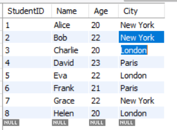
- Khi dùng code:
```sql
-- Đếm số sinh viên theo từng địa chỉ
SELECT City, COUNT(*) AS StudentCount
FROM Student
GROUP BY City;
```
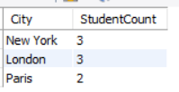

- 1 ví dụ khác:
```sql
-- Tính số tín chỉ trung bình theo từng môn học
SELECT CourseName, AVG(Credits) AS AvgCredits
FROM Course
GROUP BY CourseName;
```
### 6. HAVING
- Thường được dùng với mệnh đề `GROUP BY` lọc nhóm dựa trên một điều kiện xác định sau khi nhóm
- Nếu bỏ qua mệnh đề `GROUP BY`, mệnh đề `HAVING` sẽ hoạt động giống như mệnh đề `WHERE`
```sql
-- Lấy những địa chỉ có từ 2 sinh viên trở lên
SELECT Address, COUNT(*) AS StudentCount
FROM Student
GROUP BY Address
HAVING COUNT(*) >= 2;

-- Lấy môn học có số tín chỉ trung bình > 3
SELECT CourseName, AVG(Credits) AS AvgCredits
FROM Course
GROUP BY CourseName
HAVING AVG(Credits) > 3;
```

## VI. Các loại JOIN:
Giả sử chúng ta có 2 bảng Student & CourseEnrollment:

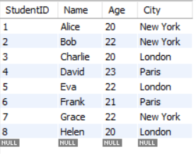

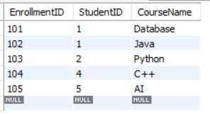

### a. INNER JOIN:
- Trả về tập hợp các dữ liệu thỏa mãn những điều kiện chung của cả 2 bảng
```sql
SELECT s.StudentID, s.Name, c.CourseName
FROM Student s
INNER JOIN CourseEnrollment c
ON s.StudentID = c.StudentID;
```
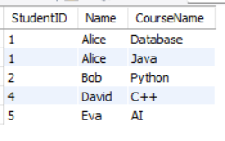

### b. LEFT JOIN:
- Trả về tập hợp các dữ liệu từ bảng bên trái và các dòng đúng với điều kiện từ bảng bên phải
```sql
SELECT s.StudentID, s.Name, c.CourseName
FROM Student s
LEFT JOIN CourseEnrollment c
ON s.StudentID = c.StudentID;
```
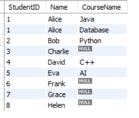

### c. RIGHT JOIN
- Trả về tập hợp các dữ liệu từ bảng bên phải và các dòng đúng với điều kiện từ bảng bên trái
```sql
SELECT s.StudentID, s.Name, c.CourseName
FROM Student s
RIGHT JOIN CourseEnrollment c
ON s.StudentID = c.StudentID;
```
Giả sử xóa đi studentID = 5 trước đó, ta sẽ có cột bên trái là null
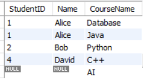

### d. FULL OUTER JOIN
- Lấy tất cả bản ghi ở cả hai bảng, khớp thì ghép, không khớp thì NULL
- Ở MySQL thì không có FULL OUTER JOIN mà cần sử dụng UNION
```sql
SELECT s.StudentID, s.Name, c.CourseName
FROM Student s
LEFT JOIN CourseEnrollment c
ON s.StudentID = c.StudentID
UNION
SELECT s.StudentID, s.Name, c.CourseName
FROM Student s
RIGHT JOIN CourseEnrollment c
ON s.StudentID = c.StudentID;
```
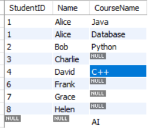

### e. CROSS JOIN
- Kết hợp mọi bản ghi của bảng 1 với mọi bản ghi của bảng 2 (tích Descartes)
```sql
SELECT s.Name, c.CourseName
FROM Student s
CROSS JOIN CourseEnrollment c;
```
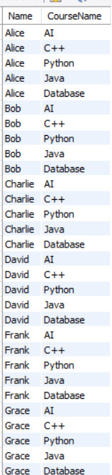
