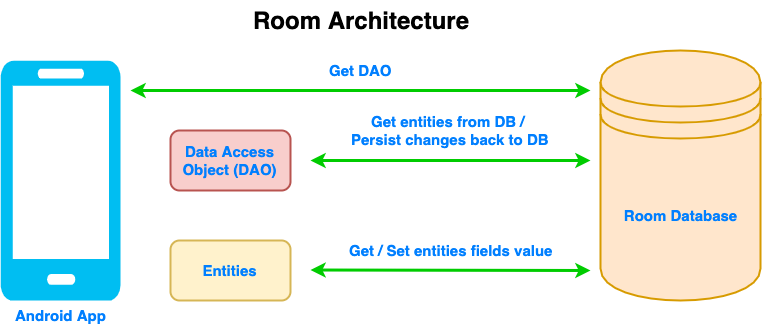
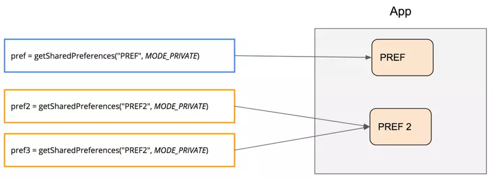

# Buổi 13: Room Database
---
- [Buổi 13: Room Database](#buổi-13-room-database)
  - [I. SQLite \& MySQL](#i-sqlite--mysql)
    - [a. SQLite là gì:](#a-sqlite-là-gì)
    - [b. Các bước thao tác với SQLite](#b-các-bước-thao-tác-với-sqlite)
      - [1. **Tạo lớp kế thừa `SQLiteOpenHelper`**](#1-tạo-lớp-kế-thừa-sqliteopenhelper)
    - [2. **Mở database**](#2-mở-database)
    - [3. **Thêm dữ liệu (INSERT)**](#3-thêm-dữ-liệu-insert)
    - [4. **Đọc dữ liệu (SELECT)**](#4-đọc-dữ-liệu-select)
    - [5. **Cập nhật dữ liệu (UPDATE)**](#5-cập-nhật-dữ-liệu-update)
    - [6. **Xóa dữ liệu (DELETE)**](#6-xóa-dữ-liệu-delete)
    - [7. **Đóng database khi không dùng nữa**](#7-đóng-database-khi-không-dùng-nữa)
    - [c. So sánh:](#c-so-sánh)
  - [II. Room database](#ii-room-database)
    - [a. Room database là gì](#a-room-database-là-gì)
    - [b. Cách tạo Room database](#b-cách-tạo-room-database)
      - [1. Thiết lập](#1-thiết-lập)
      - [2. Data entity - Thực thể dữ liệu](#2-data-entity---thực-thể-dữ-liệu)
      - [3. DAO](#3-dao)
      - [4. Database class:](#4-database-class)
      - [5. Cách sử dụng:](#5-cách-sử-dụng)
  - [III. DAO \& Entity](#iii-dao--entity)
    - [a. Entity](#a-entity)
    - [b. DAO](#b-dao)
  - [IV. Relationship trong Room và cách sử dụng](#iv-relationship-trong-room-và-cách-sử-dụng)
    - [1. Một số nguyên tắc:](#1-một-số-nguyên-tắc)
    - [2. One-to-One (1–1)](#2-one-to-one-11)
    - [3. One-to-Many (1–N)](#3-one-to-many-1n)
    - [4. Many-to-Many (N–N) với bảng nối](#4-many-to-many-nn-với-bảng-nối)
    - [5. Ghi/đọc quan hệ trong một giao dịch](#5-ghiđọc-quan-hệ-trong-một-giao-dịch)
    - [6. Truy vấn quan hệ + lọc/giới hạn](#6-truy-vấn-quan-hệ--lọcgiới-hạn)
    - [8. Database \& Wire-up](#8-database--wire-up)
  - [V. SharedPreferences](#v-sharedpreferences)
    - [a. Cấu trúc bên trong của Shared Preferences:](#a-cấu-trúc-bên-trong-của-shared-preferences)
    - [b. Lấy dữ liệu:](#b-lấy-dữ-liệu)
    - [c. Lưu dữ liệu qua `commit()`](#c-lưu-dữ-liệu-qua-commit)
    - [d. Lưu giá trị thông qua `apply()`](#d-lưu-giá-trị-thông-qua-apply)
    - [e. Các thao tác khác:](#e-các-thao-tác-khác)
---
## I. SQLite & MySQL
### a. SQLite là gì:
- **SQLite** hay **SQL Lite**, đây là 1 SQL nhỏ gọn, dễ dàng nhúng vào trong ứng dụng.
- **SQLite** là **1 thư viện phần mềm** cung cấp quản lý CSDL quan hệ (relational database management)
- **SQLite** hoạt động theo **Serverless**, tức là không yêu cầu máy chủ để chạy

- Đối với Android:
  - Android SQLite Database là 1 CSDL mã nguồn mở được cung cấp trong Android.
  - SQLite là 1 CSDL Offline, được lưu trữ cục bộ trên thiết bị với dữ liệu được lưu dạng File Text. Ta sẽ không cần tạo conection nào tới để kết nối tới db này.
  - Dữ liệu sẽ được lưu dưới dạng tables, giống như lưu trữ trong Google sheet hay Excel. Dạng biểu diễn của SQLite:
    
- 1 số method quan trọng trong SQLite:

| **Method**                          | **Mô tả**                                         |
| ----------------------------------- | --------------------------------------------------------------- |
| `getColumnNames()`                  | Trả về một mảng chứa tên các cột trong bảng SQLite.             |
| `getCount()`                        | Trả về số lượng hàng (rows) trong Cursor.                       |
| `isClosed()`                        | Trả về giá trị Boolean cho biết Cursor đã bị đóng hay chưa.     |
| `getColumnCount()`                  | Trả về tổng số cột có trong bảng.                               |
| `getColumnName(int columnIndex)`    | Trả về tên của cột khi truyền vào chỉ số (index) của cột đó.    |
| `getColumnIndex(String columnName)` | Trả về chỉ số (index) của cột dựa trên tên cột được truyền vào. |
| `getPosition()`                     | Trả về vị trí hiện tại của Cursor trong bảng.                   |
### b. Các bước thao tác với SQLite

#### 1. **Tạo lớp kế thừa `SQLiteOpenHelper`**

* Đây là lớp quản lý database, giúp tạo và nâng cấp cơ sở dữ liệu.
* Override 2 hàm chính:

  * `onCreate(SQLiteDatabase db)`: tạo bảng khi DB được tạo lần đầu.
  * `onUpgrade(SQLiteDatabase db, int oldVersion, int newVersion)`: cập nhật khi DB thay đổi version.

```kotlin
class MyDatabaseHelper(context: Context) :
    SQLiteOpenHelper(context, "mydb.db", null, 1) {

    override fun onCreate(db: SQLiteDatabase) {
        db.execSQL("CREATE TABLE Users(id INTEGER PRIMARY KEY, name TEXT, age INTEGER)")
    }

    override fun onUpgrade(db: SQLiteDatabase, oldVersion: Int, newVersion: Int) {
        db.execSQL("DROP TABLE IF EXISTS Users")
        onCreate(db)
    }
}
```

---

### 2. **Mở database**

* Sử dụng:

  * `writableDatabase` nếu muốn thêm/sửa/xóa.
  * `readableDatabase` nếu chỉ cần đọc dữ liệu.

```kotlin
val dbHelper = MyDatabaseHelper(this)
val db = dbHelper.writableDatabase
```

---

### 3. **Thêm dữ liệu (INSERT)**

* Dùng `ContentValues` để đưa dữ liệu vào bảng.

```kotlin
val values = ContentValues().apply {
    put("name", "Nguyen Van A")
    put("age", 20)
}
db.insert("Users", null, values)
```
- Cú pháp tương đương trong SQL:
```SQL
INSERT INTO Users (name, age)
VALUES ('Nguyen Van A', 20);
```
---

### 4. **Đọc dữ liệu (SELECT)**

* Dùng `rawQuery()` hoặc `query()`.
* Kết quả trả về là một **Cursor**.

```kotlin
val cursor = db.rawQuery("SELECT * FROM Users", null)
while (cursor.moveToNext()) {
    val id = cursor.getInt(cursor.getColumnIndexOrThrow("id"))
    val name = cursor.getString(cursor.getColumnIndexOrThrow("name"))
    val age = cursor.getInt(cursor.getColumnIndexOrThrow("age"))
    println("$id - $name - $age")
}
cursor.close()
```
- Cú pháp tương đương trong SQL:
```SQL
SELECT * FROM Users;
```
---

### 5. **Cập nhật dữ liệu (UPDATE)**

```kotlin
val values = ContentValues().apply {
    put("age", 21)
}
db.update(
    "Users", //Tên bảng
    values, // Giá trị được update theo định nghĩa trên
    "id = ?", //Đk where
    arrayOf("1") // Giá trị thay thế cho ?
)
```
- Cú pháp tương đương trong SQL:
```SQL
UPDATE Users
SET age = 21
WHERE id = 1;
```
---

### 6. **Xóa dữ liệu (DELETE)**

```kotlin
db.delete(
    "Users", 
    "id = ?", 
    arrayOf("1")
)
```
- Cú pháp tương đương trong MySQL:
```SQL
DELETE FROM Users
WHERE id = 1;
```
---

### 7. **Đóng database khi không dùng nữa**

```kotlin
db.close()
```
---

### c. So sánh:

| **Tiêu chí**             | **SQLite**                                                                 | **MySQL**                                                           |
| ------------------------ | -------------------------------------------------------------------------- | ------------------------------------------------------------------- |
| **Kiểu hệ quản trị**     | CSDL quan hệ **nhẹ**, nhúng trực tiếp vào ứng dụng (embedded, serverless). | CSDL quan hệ **client–server**, cần cài đặt và chạy server riêng.   |
| **Cài đặt**              | **Không cần cài đặt**, có sẵn trong Android, Python, iOS…                  | Phải **cài đặt server MySQL** và cấu hình.                          |
| **Kích thước**           | Nhỏ gọn (chỉ vài MB), phù hợp app di động, desktop, IoT.                   | Nặng hơn, phù hợp cho hệ thống web/app lớn, nhiều người dùng.       |
| **Hiệu năng**            | Tốt cho ứng dụng nhỏ, đơn giản, ít người truy cập đồng thời.               | Tối ưu cho ứng dụng có lượng truy cập lớn, nhiều kết nối đồng thời. |
| **Quản lý dữ liệu**      | Lưu dữ liệu trong **1 file duy nhất** trên máy (VD: `.db`).                | Dữ liệu lưu trữ trên **server** với nhiều DB, user, phân quyền.     |
| **Khả năng mở rộng**     | Hạn chế khi hệ thống lớn, nhiều user.                                      | Dễ dàng mở rộng, dùng trong hệ thống doanh nghiệp.                  |
| **Bảo mật & phân quyền** | Hạn chế (chỉ basic file-level security).                                   | Có hệ thống phân quyền user, role, password, SSL…                   |
| **Ứng dụng phổ biến**    | App di động (Android, iOS), app desktop nhỏ, testing, caching.             | Website, hệ thống thương mại điện tử,...                    |

- **SQLite**: nhẹ, đơn giản, phù hợp ứng dụng mobile, desktop, nhúng.
- **MySQL**: mạnh, phân tán, phù hợp ứng dụng web, hệ thống lớn nhiều user.

## II. Room database

### a. Room database là gì
- Room DB được xây dựng dựa trên SQLite, nó đóng vai trò là abstraction layer (lớp trung gian) giúp làm việc với SQLite dễ dàng và an toàn hơn.

- Các dữ liệu vẫn được lưu trữ trong SQLite Database của Android.

- Các thành phần chính trong Room:
  - **Lớp cơ sở dữ liệu (RoomDatabase)**: cung cấp cho ứng dụng các DAO.
  - **Đối tượng truy cập dữ liệu (DAO)**: là cầu nối để ứng dụng truy xuất hoặc thao tác dữ liệu.
  - **Thực thể (Entity)**: ánh xạ trực tiếp tới các bảng trong CSDL.
  - Ứng dụng có thể dùng Entity để:
    - Lấy dữ liệu (SELECT).
    - Cập nhật dữ liệu (UPDATE).
    - Thêm dữ liệu mới (INSERT).


- Ưu điểm so với SQLite:

| **SQLite**                                                    | **Room**                                                                                    |
| -------------------------------------------------------------------------- | ------------------------------------------------------------------------------------------- |
| Phải tự viết SQL (`CREATE TABLE`, `INSERT`, `UPDATE`, `DELETE`, `SELECT`). | Chỉ cần viết **Entity (data class)** và **DAO (interface)**, Room sẽ sinh ra SQL tương ứng. |
| Thao tác với `Cursor` thủ công, dễ lỗi.                                    | Trả về **List**, **LiveData**, **Flow**… dễ xử lý trong Kotlin/Android.                     |
| Không có compile-time check: viết sai SQL chỉ báo lỗi khi chạy app.        | Có compile-time check: sai SQL sẽ báo lỗi ngay khi build.                                   |
| Phải quản lý migration bằng `onUpgrade()`.                                 | Room hỗ trợ **Migration API**, tiện hơn khi thay đổi cấu trúc DB.|

- Nhược điểm so với SQLite thuần:
  - Room dùng annotation (`@Entity`, `@Dao`, `@Query`, ...) compiler sẽ generate code để sử dụng sang SQLite. Chính vì thế nó sẽ khiến thời gian Build lâu hơn. Các ứng dụng nhỏ thì không thấy sự khác biệt quá nhiều nhưng các ứng dụng to thì việc dùng SQLite sẽ nhanh hơn.
  - Một số tính năng SQLite nâng cao (CTE – Common Table Expression, JSON1 extension, virtual tables như FTS – Full Text Search) không được Room hỗ trợ trực tiếp, phải fallback về `@RawQuery`.
### b. Cách tạo Room database
#### 1. Thiết lập
- Vào `build.gradle`:
```kts
dependencies {
    val room_version = "2.7.2"

    implementation("androidx.room:room-runtime:$room_version")

    // If this project uses any Kotlin source, use Kotlin Symbol Processing (KSP)
    // See Add the KSP plugin to your project
    ksp("androidx.room:room-compiler:$room_version")

    // If this project only uses Java source, use the Java annotationProcessor
    // No additional plugins are necessary
    annotationProcessor("androidx.room:room-compiler:$room_version")

    // optional - Kotlin Extensions and Coroutines support for Room
    implementation("androidx.room:room-ktx:$room_version")

    // optional - RxJava2 support for Room
    implementation("androidx.room:room-rxjava2:$room_version")

    // optional - RxJava3 support for Room
    implementation("androidx.room:room-rxjava3:$room_version")

    // optional - Guava support for Room, including Optional and ListenableFuture
    implementation("androidx.room:room-guava:$room_version")

    // optional - Test helpers
    testImplementation("androidx.room:room-testing:$room_version")

    // optional - Paging 3 Integration
    implementation("androidx.room:room-paging:$room_version")
}
```

- *Chỉ chọn 1 trong 2 thuộc tính `ksp` hoặc `annotationProcessor`*
---
#### 2. Data entity - Thực thể dữ liệu
```kotlin
@Entity
data class User(
    @PrimaryKey val uid: Int,
    @ColumnInfo(name = "first_name") val firstName: String?,
    @ColumnInfo(name = "last_name") val lastName: String?
)
```
- Code này sẽ định nghĩa 1 data entity `User`. Mỗi `instance` sẽ biểu thị 1 hàng của bảng `user` thuộc DB.
Ta sẽ có table của `user` như sau:

- Chi tiết hơn về Entity sẽ ở phần [Entity](#a-entity)
- Hiểu đơn giản là nó sẽ định nghĩa trong bảng có các cột như thế nào. Mỗi `instance` của `data class` này sẽ là 1 hàng trong table.
---
#### 3. DAO
```kotlin
@Dao
interface UserDao {
    @Query("SELECT * FROM user")
    fun getAll(): List<User>

    @Query("SELECT * FROM user WHERE uid IN (:userIds)")
    fun loadAllByIds(userIds: IntArray): List<User>

    @Query("SELECT * FROM user WHERE first_name LIKE :first AND " +
           "last_name LIKE :last LIMIT 1")
    fun findByName(first: String, last: String): User

    @Insert
    fun insertAll(vararg users: User)

    @Delete
    fun delete(user: User)
}
```
- Các **DAO** sẽ có nhiệm vụ cung cấp các phương thức để ứng dụng có thể tương tác với dữ liệu trong bảng `user`.
- Ví dụ trên như `UserDao` sẽ cung cấp các phương thức, những phương thức ấy có thể truy ra các Query để giao tiếp với bảng ở DB.
- Dễ hiểu thì **DAO** cung cấp phương thức compile sang Query để giao tiếp với các Entity trong Tables.
- Chi tiết hơn về DAO sẽ ở phần [DAO](#b-dao)
---
#### 4. Database class:
- Ở đây sẽ xây dựng 1 DB để định nghĩa cấu hình CSDL và đóng vai trò làm điểm truy cập chính của ứng dụng vào các dữ liệu cố định. 
- Database class cần phải đảm bảo những điều sau:
  - Cần có chú giải `@Database` có chứa 1 array `entities` là list tất cả data entities được liên kết với database.
  - Nó cần là `abstract class` extends từ `RoomDatabase`.
  - Với mỗi lớp **DAO** được liên kết với DB, DB class cần định nghĩa `abstract method` không có đối số và trả về **instance** của `DAO class`
- Ví dụ về 1 `AppDatabase` dựa trên Entity và DAO ở trên:
```kotlin
@Database(entities = [User::class], version = 1)
abstract class AppDatabase : RoomDatabase() {
  abstract fun userDAO() : UserDao
}
```
- ***Lưu ý:***
  - Trong trường hợp ứng dụng chạy trong 1 process:
    - Ta chỉ cần tạo 1 object `AppDatabase` duy nhất trong vòng đời của ứng dụng. Bởi vì chỉ có 1 process duy nhất nên việc truy cập tới file SQLite sẽ không bị xung đột ở đâu.
    - Vì việc khởi tạo `RoomDatabase` rất ngốn tài nguyên nên dùng **Singleton Pattern** để đảm bảo chỉ tạo ra 1 instance:
    ```kotlin
    @Database(entities = [User::class], version = 1)
    abstract class AppDatabase : RoomDatabase() {
      abstract fun userDAO() : UserDao
    }

    companion object {
        @Volatile
        private var INSTANCE: AppDatabase? = null

        fun getDatabase(context: Context): AppDatabase {
            return INSTANCE ?: synchronized(this) {
                val instance = Room.databaseBuilder(
                    context.applicationContext,
                    AppDatabase::class.java,
                    "app_database"
                ).build()
                INSTANCE = instance
                instance
            }
        }
    }
    ```
  - Trường hợp ứng dụng chạy nhiều process:
    - Khi có nhiều process chạy song song. Khi ấy sẽ có nhiều **instance** của `AppDatabase` truy cập vào cùng 1 file SQLite. Nếu 1 process cập nhật dữ liệu thì các process khác chưa chắc đã cập nhật kịp.
    - Vì thế ta sẽ gọi `enableMultiInstanceInvalidation()` khi build database.
    ```kotlin
    companion object {
        @Volatile
        private var INSTANCE: AppDatabase? = null

        fun getDatabase(context: Context): AppDatabase {
            return INSTANCE ?: synchronized(this) {
                val instance = Room.databaseBuilder(
                    context.applicationContext,
                    AppDatabase::class.java,
                    "app_database"
                )
                .enableMultiInstanceInvalidation()
                .build()
                INSTANCE = instance
                instance
            }
        }
    }
    ```
---
#### 5. Cách sử dụng:
- Tạo 1 instance của Database và lấy ra các DAO của db:
```kotlin
val db = AppDatabase.getDatabase(context)
val userDao = db.userDao()
```
- Lúc này dựa vào methods được định nghĩa trong DAO ta sẽ lấy ra được các data entity:
```kotlin
val users : List<User> = userDao().getAll()
```
## III. DAO & Entity
### a. Entity
```kotlin
@Entity
data class User(
    @PrimaryKey val id: Int,

    val firstName: String?,
    val lastName: String?
)
```
- Như đã nói ở trên, Room sẽ sử dụng tên Data class làm tên table, các tên trường làm tên cột trong DB, nếu muốn 1 tên khác thì thêm chú thích `@ColumnInfo` và trường và đặt thuộc tính name

```kotlin
@Entity(tableName = "users")
data class User (
    @PrimaryKey val id: Int,
    @ColumnInfo(name = "first_name") val firstName: String?,
    @ColumnInfo(name = "last_name") val lastName: String?
)
```

- Trong này, ta sẽ cần xác định khóa chính thông qua `@PrimaryKey` như ở trên. Nếu muốn xác định khóa chính tổng hợp, ta có thể liệt kê các cột đó trong thuộc tính của `@Entity`
```kotlin
@Entity(primaryKeys = ["firstName", "lastName"])
data class User(
    val firstName: String?,
    val lastName: String?
)
```

- Nếu entity có chứa những trường mà không muốn lưu trữ, thì ta có thể sử dụng từ khóa `@Ignore`
```kotlin
@Entity
data class User(
    @PrimaryKey val id: Int,
    val firstName: String?,
    val lastName: String?,
    @Ignore val picture: Bitmap?
)
```

- Nếu như entity kế thừa từ 1 thực thể mẹ thì dùng thuộc tính `ignoreColumns` của `@Entity`
```kotlin
open class User {
    var picture: Bitmap? = null
}

@Entity(ignoredColumns = ["picture"])
data class RemoteUser(
    @PrimaryKey val id: Int,
    val hasVpn: Boolean
) : User()
```
### b. DAO
- DAO có thể là interface hoặc abstract class. DAO cho phép ta định nghĩa các Query về các hàm để tương tác với các dữ liệu trong DB.
- Mẫu:
```kotlin
@Dao
interface UserDao {
    @Insert
    fun insertAll(vararg users: User)

    @Delete
    fun delete(user: User)

    @Query("SELECT * FROM user")
    fun getAll(): List<User>
}
```
- Có 4 phương thức đó là: `@Insert`, `@Update`, `@Delete` và `@Query`
  - 3 phương thức đầu ta không cần phải thêm các câu lệnh SQL vào trong nữa bởi nó đã có sẵn, đôi lúc sẽ có những thuộc tính thêm thì mới viết vào
  - `@Query` cho phép ghi các câu lệnh SQL và hiển thị chúng dưới dạng các method của DAO. Ví dụ ở trên là lấy hết tất cả users.
- Chi tiết về `@Query`:
Dưới đây mình đã viết lại phần tài liệu mà ta gửi thành dạng **Markdown** rõ ràng, dễ đọc hơn, kèm theo một số cải tiến (cấu trúc mục, highlight code, ghi chú quan trọng).
  - **Trả về một tập hợp nhỏ các cột của bảng**:

    Trong thường hợp ta chỉ cần truy cập tới 1 số cột của table, ta sẽ làm như sau:

    ```kotlin
    data class NameTuple(
        @ColumnInfo(name = "first_name") val firstName: String?,
        @ColumnInfo(name = "last_name") val lastName: String?
    )
    ```

    DAO:

    ```kotlin
    @Query("SELECT first_name, last_name FROM user")
    fun loadFullName(): List<NameTuple>
    ```

  -  **Truyền tham số vào truy vấn**:

        Ví dụ 1: Tham số đơn

        ```kotlin
        @Query("SELECT * FROM user WHERE age > :minAge")
        fun loadAllUsersOlderThan(minAge: Int): Array<User>
        ```

        Ví dụ 2: Nhiều tham số

        ```kotlin
        @Query("SELECT * FROM user WHERE age BETWEEN :minAge AND :maxAge")
        fun loadAllUsersBetweenAges(minAge: Int, maxAge: Int): Array<User>

        @Query("SELECT * FROM user WHERE first_name LIKE :search OR last_name LIKE :search")
        fun findUserWithName(search: String): List<User>
        ```


  - **Truyền danh sách tham số (IN query)**:

    Ta có thể truyền danh sách để Room tự mở rộng trong runtime.

    ```kotlin
    @Query("SELECT * FROM user WHERE region IN (:regions)")
    fun loadUsersFromRegions(regions: List<String>): List<User>
    ```

  - **Truy vấn nhiều bảng (JOIN)**:

    Ví dụ: Tìm sách mà một user đang mượn:

    ```kotlin
    @Query(
        "SELECT * FROM book " +
        "INNER JOIN loan ON loan.book_id = book.id " +
        "INNER JOIN user ON user.id = loan.user_id " +
        "WHERE user.name LIKE :userName"
    )
    fun findBooksBorrowedByNameSync(userName: String): List<Book>
    ```

  - **Trả về đối tượng tùy chỉnh**:

    ```kotlin
    interface UserBookDao {
        @Query(
            "SELECT user.name AS userName, book.name AS bookName " +
            "FROM user, book " +
            "WHERE user.id = book.user_id"
        )
        fun loadUserAndBookNames(): LiveData<List<UserBook>>

        data class UserBook(val userName: String?, val bookName: String?)
    }
    ```

  - **Trả về **Multimap** (Room 2.4+)**:

    Thay vì tạo data class, ta có thể trả về `Map<User, List<Book>>`.

    ```kotlin
    @Query(
        "SELECT * FROM user " +
        "JOIN book ON user.id = book.user_id"
    )
    fun loadUserAndBookNames(): Map<User, List<Book>>
    ```

    **Kết hợp với `GROUP BY`**

    Ví dụ: chỉ lấy user đã mượn ≥ 3 sách:

    ```kotlin
    @Query(
        "SELECT * FROM user " +
        "JOIN book ON user.id = book.user_id " +
        "GROUP BY user.name HAVING COUNT(book.id) >= 3"
    )
    fun loadUserAndBookNames(): Map<User, List<Book>>
    ```

  - **Trả về Map key-value đơn giản với `@MapInfo`**:

    Nếu không cần ánh xạ cả object, có thể chỉ lấy cột cụ thể:

    ```kotlin
    @MapInfo(keyColumn = "userName", valueColumn = "bookName")
    @Query(
        "SELECT user.name AS userName, book.name AS bookName " +
        "FROM user JOIN book ON user.id = book.user_id"
    )
    fun loadUserAndBookNames(): Map<String, List<String>>
    ```

## IV. Relationship trong Room và cách sử dụng
### 1. Một số nguyên tắc:

* Khóa ngoại: đặt trong `@Entity(foreignKeys = […])` + `indices` để JOIN nhanh.
* Đọc quan hệ: tạo **POJO quan hệ** với `@Embedded` + `@Relation`.
* Nhiều bảng: phương thức DAO đọc quan hệ phải có `@Transaction`.
* Xóa/cập nhật: dùng `onDelete = CASCADE`, `onUpdate = CASCADE` khi phù hợp.
* N-N: tạo **bảng nối** (`CrossRef`) và dùng `@Junction`.

### 2. One-to-One (1–1)

Ví dụ: `User` – `UserProfile` (mỗi user có đúng 1 profile).

```kotlin
import androidx.room.*

@Entity(
    indices = [Index(value = ["email"], unique = true)]
)
data class User(
    @PrimaryKey(autoGenerate = true) val userId: Long = 0,
    val email: String,
    val name: String
)

@Entity(
    foreignKeys = [
        ForeignKey(
            entity = User::class,
            parentColumns = ["userId"],
            childColumns = ["ownerUserId"],
            onDelete = ForeignKey.CASCADE,
            onUpdate = ForeignKey.CASCADE
        )
    ],
    indices = [Index("ownerUserId", unique = true)] // 1-1 -> unique
)
data class UserProfile(
    @PrimaryKey(autoGenerate = true) val profileId: Long = 0,
    val ownerUserId: Long,
    val avatarUrl: String?,
    val bio: String?
)

// POJO quan hệ
data class UserWithProfile(
    @Embedded val user: User,
    @Relation(
        parentColumn = "userId",
        entityColumn = "ownerUserId"
    )
    val profile: UserProfile?
)

@Dao
interface UserDao {
    @Insert suspend fun insertUser(user: User): Long
    @Insert suspend fun insertProfile(profile: UserProfile): Long

    @Transaction
    @Query("SELECT * FROM User WHERE userId = :id")
    suspend fun getUserWithProfile(id: Long): UserWithProfile?
}
```

***Lưu ý***: ràng buộc unique ở `ownerUserId` đảm bảo đúng 1-1.
### 3. One-to-Many (1–N)

Ví dụ: `User` – `Book` (một user sở hữu nhiều sách).

```kotlin
@Entity(
    foreignKeys = [
        ForeignKey(
            entity = User::class,
            parentColumns = ["userId"],
            childColumns = ["ownerUserId"],
            onDelete = ForeignKey.CASCADE
        )
    ],
    indices = [Index("ownerUserId")]
)
data class Book(
    @PrimaryKey(autoGenerate = true) val bookId: Long = 0,
    val ownerUserId: Long,
    val title: String
)

data class UserWithBooks(
    @Embedded val user: User,
    @Relation(
        parentColumn = "userId",
        entityColumn = "ownerUserId"
    )
    val books: List<Book>
)

@Dao
interface BookDao {
    @Insert suspend fun insert(book: Book): Long

    @Transaction
    @Query("SELECT * FROM User WHERE userId = :userId")
    suspend fun getUserWithBooks(userId: Long): UserWithBooks?

    @Transaction
    @Query("SELECT * FROM User")
    suspend fun getAllUsersWithBooks(): List<UserWithBooks>
}
```

***Lưu ý***: `@Transaction` đảm bảo tính nhất quán khi Room chạy nhiều truy vấn để lắp quan hệ.
### 4. Many-to-Many (N–N) với bảng nối

Ví dụ: `Student` – `Course` với `StudentCourseCrossRef`.

```kotlin
@Entity
data class Student(
    @PrimaryKey(autoGenerate = true) val studentId: Long = 0,
    val name: String
)

@Entity
data class Course(
    @PrimaryKey(autoGenerate = true) val courseId: Long = 0,
    val title: String
)

// Bảng nối
@Entity(
    primaryKeys = ["studentId", "courseId"],
    indices = [Index("courseId")],
    foreignKeys = [
        ForeignKey(
            entity = Student::class,
            parentColumns = ["studentId"],
            childColumns = ["studentId"],
            onDelete = ForeignKey.CASCADE
        ),
        ForeignKey(
            entity = Course::class,
            parentColumns = ["courseId"],
            childColumns = ["courseId"],
            onDelete = ForeignKey.CASCADE
        )
    ]
)
data class StudentCourseCrossRef(
    val studentId: Long,
    val courseId: Long
)

// POJO 1: Student với danh sách Course
data class StudentWithCourses(
    @Embedded val student: Student,
    @Relation(
        parentColumn = "studentId",
        entityColumn = "courseId",
        associateBy = Junction(StudentCourseCrossRef::class)
    )
    val courses: List<Course>
)

// POJO 2: Course với danh sách Student
data class CourseWithStudents(
    @Embedded val course: Course,
    @Relation(
        parentColumn = "courseId",
        entityColumn = "studentId",
        associateBy = Junction(StudentCourseCrossRef::class)
    )
    val students: List<Student>
)

@Dao
interface EnrollmentDao {
    @Insert suspend fun insertStudent(student: Student): Long
    @Insert suspend fun insertCourse(course: Course): Long
    @Insert suspend fun enroll(ref: StudentCourseCrossRef)

    @Transaction
    @Query("SELECT * FROM Student WHERE studentId = :id")
    suspend fun getStudentWithCourses(id: Long): StudentWithCourses?

    @Transaction
    @Query("SELECT * FROM Course WHERE courseId = :id")
    suspend fun getCourseWithStudents(id: Long): CourseWithStudents?
}
```
### 5. Ghi/đọc quan hệ trong một giao dịch

Khi cần tạo nhiều bản ghi có quan hệ trong một lần, bọc lại trong DAO:

```kotlin
@Dao
interface UserWriteDao {
    @Insert suspend fun insertUser(user: User): Long
    @Insert suspend fun insertProfile(profile: UserProfile): Long
    @Insert suspend fun insertBooks(books: List<Book>): List<Long>

    @Transaction
    suspend fun createUserWithProfileAndBooks(
        user: User,
        profile: UserProfile?,
        books: List<Book>
    ): Long {
        val userId = insertUser(user)
        profile?.let { insertProfile(it.copy(ownerUserId = userId)) }
        if (books.isNotEmpty()) {
            insertBooks(books.map { it.copy(ownerUserId = userId) })
        }
        return userId
    }
}
```
### 6. Truy vấn quan hệ + lọc/giới hạn

Ta có thể kết hợp `@Relation` với truy vấn cha **có điều kiện**, rồi lọc tiếp trong code:

```kotlin
@Dao
interface QueryDao {
    @Transaction
    @Query("SELECT * FROM User WHERE name LIKE :q ORDER BY userId LIMIT :limit OFFSET :offset")
    suspend fun searchUsersWithBooks(q: String, limit: Int, offset: Int): List<UserWithBooks>
}
```
### 8. Database & Wire-up

```kotlin
@Database(
    entities = [
        User::class, UserProfile::class, Book::class,
        Student::class, Course::class, StudentCourseCrossRef::class
    ],
    version = 1,
    exportSchema = false
)
abstract class AppDatabase : RoomDatabase() {
    abstract fun userDao(): UserDao
    abstract fun bookDao(): BookDao
    abstract fun userWriteDao(): UserWriteDao
    abstract fun enrollmentDao(): EnrollmentDao
}
```
## V. SharedPreferences
- **Shared Preferences** là nơi ta có thể lưu trữ các thông tin dưới dạng `key-value` được xây dựng sẵn trong hệ điều hành Android.
- Ví dụ:
```kotlin
val pref = getSharedPreferences("PREF", MODE_PRIVATE)
```
Đoạn code trên sẽ lấy một instance của shared preferences với tên truyền vào. instance đó có thể được sử dụng trong phạm vi toàn bộ ứng dụng bất cứ đâu nó được lấy về.

- Mỗi một shared preferences sẽ có instance riêng dựa trên tên của preference.
```kotlin
val pref2 = getSharedPreferences("PREF2", MODE_PRIVATE)
```
pref và pref2 là 2 instance khác nhau bởi vì chúng khác tên.

- Không quan trọng trong context nào (Activity, Fragment, Application, ...) mà nó được gọi, nó luôn luôn trả về instance giống nhau khi gọi method trên với tên giống nhau. Điều này đảm bảo rằng luôn luôn nhận được dữ liệu mới nhất được lưu.


### a. Cấu trúc bên trong của Shared Preferences:
- Ta có thể hình dung cấu trúc bên trong Shared Preferences là một bộ nhớ `in-memory (RAM)` đặt trên một bộ nhớ `disk-storage (External Storage)`. Mọi thao tác đều đi qua bộ nhớ **in-memory** đầu tiên sau đó mới đến **disk-storage** trong trường hợp cần thiết.

- Bộ nhớ **In-Memory** về bản chất là một `Hash-Map`, điều đó cho phép các thao tác đều có độ phức tạp là O(1) khi chạy.
```kotlin
val map = HashMap<String, Any>()
```
- **Disk Storage** thực chất là một file xml được cấu trúc như sau:
```xml
<?xml version='1.0' encoding='utf-8' standalone='yes' ?>
<map>
    <string name="KEY">value</string>
</map>
```


### b. Lấy dữ liệu:
- Tất cả các thao tác được đi qua bộ nhớ In-Memory, điều đó có nghĩa là ngay lập tức và tránh được các thao tác I/O. Bởi vì tất cả các thao tác đi qua bộ nhớ in-memory nên nó đảm bảo rằng giá trị trả về sẽ là giá trị mới nhất.
```kotlin
val value = pref.getString(key, null)
```

Nếu dữ liệu lần đầu được tải, nó sẽ đợi khi dữ liệu loaded vào bộ nhớ in-memory từ disk storage.

### c. Lưu dữ liệu qua `commit()`
- Lưu dữ liệu vào in-memory trước sau đó thực hiện ghi vào disk một cách đồng bộ. Bởi vì có sự tham gia của thao tác I/O, main thread sẽ bị blocked cho đến khi data được ghi hết vào disk storage. Đây là một thao tác kém hiệu quả so với apply()

- Bởi vì thao tác ghi dữ liệu lên disk storage là đồng bộ cho nên trạng thái trả về sẽ là một biến boolean. Do đó ta có thể xác nhận rằng liệu thao tác mà ta thực hiện có thành công hay không bằng cách kiểm tra kết quả trả về.

```kotlin
val result = pref.edit().putString(key, "value").commit()
```


### d. Lưu giá trị thông qua `apply()`
- Lưu giá trị vào in-memory trước sau đó ghi dữ liệu một cách bất đồng bộ vào disk-storage. Main thread sẽ không bị blocked và không phải đợi thao tác trên disk nữa. Tuy thao tác ghi lên disk storage là asynchronous nhưng bất kỳ thao tác read ngay sau lời gọi apply() sẽ đều trả về kết quả là mới nhất bởi vì thao tác read (get) sẽ được thực thi thông qua in-memory.

- Bởi vì thao tác ghi dữ liệu lên disk-storage là asynchronous, sẽ không có giá trị nào được trả về. Do đó ta không thể xác nhận được là liệu thao tác ta thực thi có thành công hay không,

- Hãy sử dụng apply trừ khi ta cần xác nhận kết quả của thao tác ta thực hiện.
```kotlin
pref.edit().putString(key, "value").apply()
```


### e. Các thao tác khác:
Ngoại trừ việc put và get, shared preferences còn cung cấp các thao tác sau:

- Kiểm tra xem một key có tồn tại hay không
- Lắng nghe việc thay đổi của shared preferences thông qua listener
- Đọc toàn bộ các entries thành map
- Xóa bỏ một entry
- Xóa bỏ toàn bộ các entries (Clear all)

***Shared preferences phạm vi ứng dụng được lưu tại đường dẫn:*** 
```bash
data/data/<YOUR_APP_ID>/shared_prefs/<SHARED_PREF_NAME>.xml
```