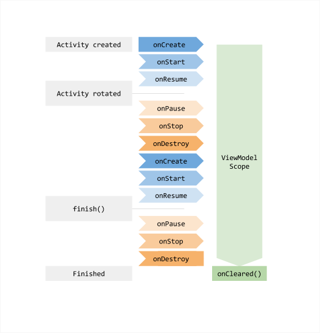
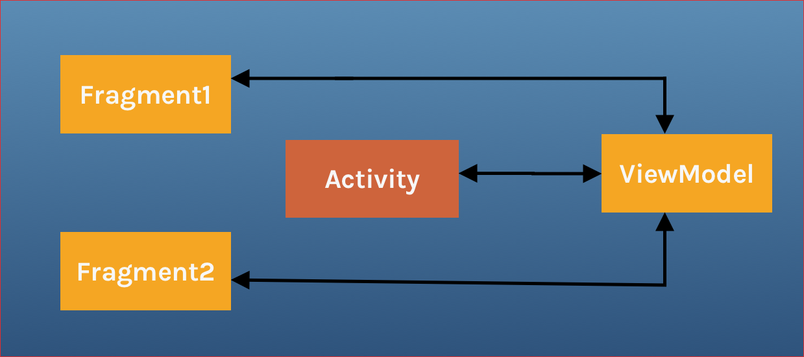
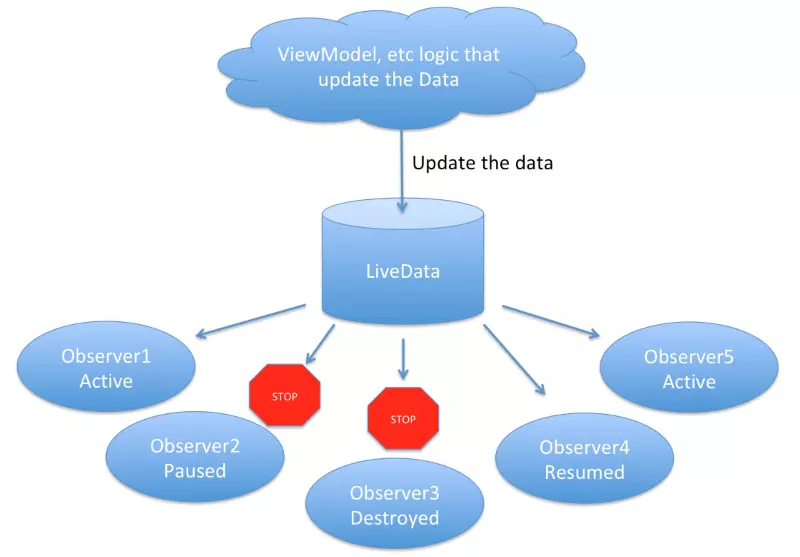
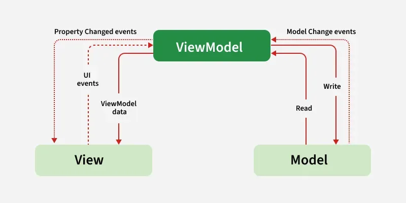
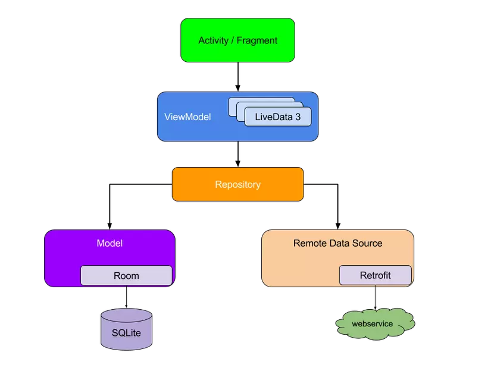
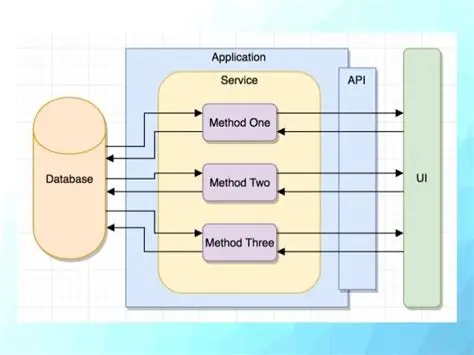
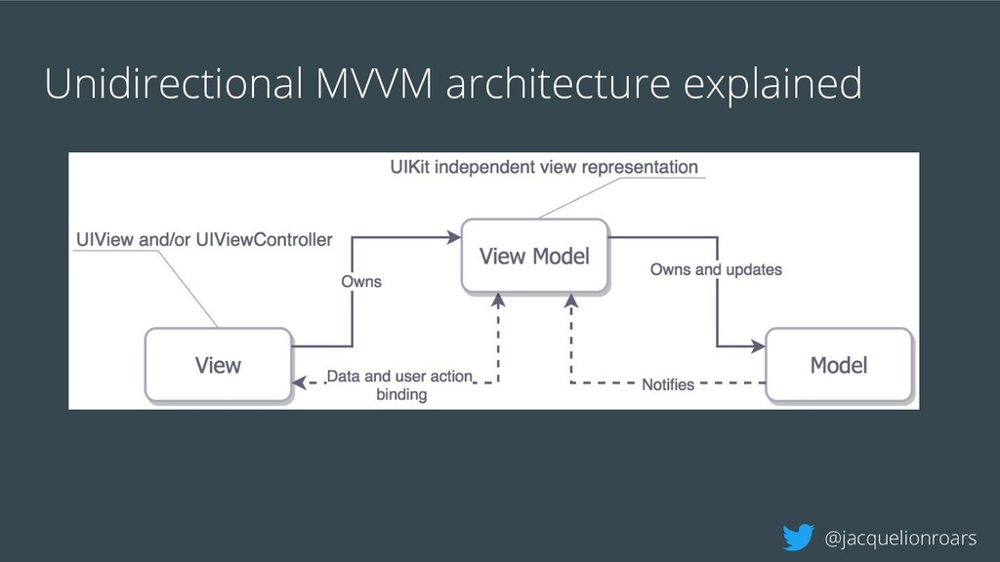

# Buổi 14: View Model

## I. ViewModel
### a. Overview:
- `ViewModel` là 1 class chuẩn bị và quản lý dữ liệu cho UI (activity hoặc fragment). 
- Vòng đời của `ViewModel` gắn liền với phạm vi của nó. `ViewModel` vẫn nằm trong bộ nhớ cho đến khi `ViewModelStoreOwner` chứa lớp này biến mất. Điều này có thể xảy ra trong các ngữ cảnh sau:
  - Activity: Khi finishes
  - Fragment: Khi fragment tách ra khỏi activity/fragment
  - Navigation entry: Khi bị xóa khỏi backstack

Đây là ví dụ khi Fragment gắn với activity, nó sẽ tồn tại cho tới khi activity này finished
- Ta thường yêu cầu `ViewModel` trong lần đầu tiên gọi tới `onCreate`, sau đấy `ViewModel` này sẽ tồn tại cho đến khi UI này kết thúc và bị hủy bỏ.
- Mục đích chính của `ViewModel` là lấy và giữ data cần thiết cho UI. UI có thể observe(quan sát) được sự thay đổi của `ViewModel` thông qua việc sử dụng `LiveData` hoặc `DataBinding`

- `ViewModel` chỉ có trách nhiệm quản lý data cho UI cho nên nó không bao giờ truy cập vào view hierarchy (cây phân cấp view) hoặc giữ tham chiếu đến UI.
- 1 số lợi ích:
  - `ViewModel` tồn tại khi quay màn hình hoặc các configuration change khác.
  - `ViewModel` vẫn running trong khi activity đang trong back stack.
  - `ViewModel` là lifecycle-aware.
  - `ViewModel` với sự hỗ trợ của LiveData có thể phản ứng lại sự thay đổi của UI. Mỗi khi data thay đổi, UI sẽ được cập nhật dựa trên sự quan sát LiveData với data hiện tại trong `ViewModel`.
  - `ViewModel` dễ dàng hiểu và dễ testing.
### b. Các bước làm việc với `ViewModel`:
- Có 4 bước chính để tạo và dùng ViewModel:
  - Thêm các dependencies vào app-level `build.gradle`.
    ```kts
    // using ViewModel
        implementation(libs.androidx.lifecycle.viewmodel.ktx)   
    ```
  - Tách data với activity bằng cách tạo một class kế thừa `ViewModel`.
    ```kotlin
    package com.example.viewmodel

    import androidx.lifecycle.ViewModel

    class SampleViewModel :ViewModel() {

        override fun onCleared() {
            super.onCleared()
            // Dispose All your Subscriptions to avoid memory leaks
        }
    }
    ```
    `onCleared()`: Sẽ được gọi khi `ViewModel` không còn được dùng và sẽ bị **destroyed**. Nó hữu ích khi `ViewModel` observe một vài data và bạn cần clear chúng để tránh việc memory leak của ViewModel
  - Tạo `ViewModel` instance trong activity.
    ```kotlin
    package com.example.viewmodel

    import androidx.appcompat.app.AppCompatActivity
    import android.os.Bundle
    import androidx.lifecycle.ViewModelProvider

    class MainActivity : AppCompatActivity() {

        // lateinit var viewModel : SampleViewModel
        private val viewModel = SampleViewModel by viewModels()

        override fun onCreate(savedInstanceState: Bundle?) {
            super.onCreate(savedInstanceState)
            setContentView(R.layout.activity_main)
            // viewModel =  ViewModelProvider(this).get(SampleViewModel::class.java)
            viewModel.doSomething()
        }
    }
    ```
    `ViewModelProvider` là một tiện ích để lấy instance của **ViewModel** trong `ViewModelStore`. Nó sẽ trả về instance của `ViewModel` nếu tồn tại còn không thì nó sẽ tạo một cái mới. `ViewModelStore` sẽ lưu trữ `ViewModel` bằng việc dùng `HashMap`.
  - Thiết lập giao tiếp giữa `ViewModel` và `View`:
    - Thiết lập `ViewModel`: Tạo một **LiveData** trong `ViewModel`, và khi click vào button chúng ta sẽ cập nhật giá trị của nó và show toast message
    ```kotlin
    package com.example.viewmodel

    import androidx.lifecycle.LiveData
    import androidx.lifecycle.MutableLiveData
    import androidx.lifecycle.ViewModel

    class SampleViewModel : ViewModel() {

        private val _badgeCount = MutableLiveData<Int>()
        var number = 0

        val badgeCount: LiveData<Int>
            get() = _badgeCount
        
        fun incrementBadgeCount() {
            _badgeCount.postValue(++number)
        }

        override fun onCleared() {
            super.onCleared()
            // Dispose All your Subscriptions to avoid memory leaks
        }

    }
    ```
    - Tạo UI:
    ```kotlin
    package com.example.viewmodel

    import android.os.Bundle
    import android.widget.Toast
    import androidx.appcompat.app.AppCompatActivity
    import androidx.lifecycle.Observer
    import androidx.lifecycle.ViewModelProvider
    import kotlinx.android.synthetic.main.activity_main.*

    class MainActivity : AppCompatActivity() {

        lateinit var viewModel: SampleViewModel

        override fun onCreate(savedInstanceState: Bundle?) {
            super.onCreate(savedInstanceState)
            setContentView(R.layout.activity_main)
            viewModel = ViewModelProvider(this).get(SampleViewModel::class.java)
            observeViewModel()
            initListeners()
        }

        private fun initListeners() {
            btn_badge?.setOnClickListener {
                viewModel.incrementBadgeCount()
            }
        }

        private fun observeViewModel() {

            viewModel.badgeCount.observe(this, Observer {
                showToast(it)
            })

        }

        private fun showToast(value: Int) {
            Toast.makeText(this, value.toString(), Toast.LENGTH_LONG).show()
        }

    }
    ```
### c. Shared ViewModel:
- Để giao tiếp giữa các fragment khác nhau, hoặc giữa fragment và activity chúng ta thường dùng interface hoặc target fragment. Nhưng dễ dàng hơn khi chúng ta share một ViewModel trong phạm vi activity.

- Để làm được, chúng ta cần tạo `ViewModel` `instance` dùng trong activity scope trong fragment, activity sẽ chỉ có chung một instance được tạo và chia sẻ với các fragment khác nhau.
- Vấn đề: Giả sử chúng ta có 2 fragments: `Fragment1` cho phép người dùng chọn một item trong list, `Fragment2` sẽ hiển thị content của item được chọn. Trong trường hợp này cả 2 fragment sẽ định nghĩa một vài interface để activity bind chúng với nhau. Thêm vào đó, cả 2 fragment phải handle luôn việc khi một trong 2 fragment chưa được tạo hoặc visible.
- Solution:
  - Chúng ta sẽ dùng chung một `ViewModel` cho những fragment này trong phạm vi activity.
  - Tạo 1 `ViewModel` dùng chung:
  ```kotlin
    class SharedViewModel : ViewModel() {
        val selected = MutableLiveData<String>()
        fun selectedItem(item: String) {
        selected.value = item
        }
    }
  ```
  - `Fragment1` và `Fragment2` được attached trong main activity, chúng ta cần post một vài thứ từ `Fragment1` sang `Fragment2` thông qua một button được click.
  ```kotlin
    class Fragment1 : Fragment() {

        private lateinit var viewModel: SharedViewModel

        override fun onCreate(savedInstanceState: Bundle?) {
            super.onCreate(savedInstanceState)    
            viewModel = activity?.let {
                ViewModelProviders.of(it)[SharedViewModel::class.java]
            } ?: throw Exception("Activity is null")       
        }
        
        btn.setOnClickListener {
            viewModel?.selectedItem("New Item posted")
        }
    }
  ```
  ```kotlin
  
    class Fragment2 : Fragment() {
        private lateinit var viewModel: SharedViewModel
        
        override fun onViewCreated(view: View, savedState:  Bundle?) {
            super.onViewCreated(view, savedInstanceState)
            //ViewModel Creation using activity scope
            activity?.let {
                ViewModelProviders.of(it)[SharedViewModel::class.java]
            } ?: throw Exception("Activity is null")
                
            //Observe data changes from ViewModel and update the UI
            model.selected.observe(viewLifecycleOwner,Observer<Item> { item ->
            Toast.makeText(this, item, Toast.LENGTH_LONG).show()
            })
        }
    }
  ```
  - `ViewModelProvider` sẽ trả về 2 fragment này cùng một instance của `SharedViewModel` trong activity scope.
- Cách tiếp cận này mang đến các lợi ích sau đây:
  - `Activity` không cần làm bất cứ điều gì về việc giao tiếp này.
  - Các `Fragment` không cần biết gì về nhau, chúng chỉ cần `SharedViewModel`. Khi một `fragment` là disappears thì `fragment` còn lại vẫn hoạt động bình thường.
  - Mỗi `fragment` đều hoạt động với vòng đời của chính nó, và không bị ảnh hưởng bởi những `fragment` khác. Cho nên, nếu một `fragment` bị replace, UI vẫn tiếp tục làm việc mà không có bất kì vấn đề nào.
## II. LiveData
### a. Overview:
- `LiveData` là observable data holder class (lớp lưu giữ dữ liệu có thể quan sát). Khác với 1 lớp có thể quan sát khác, `LiveData` có tính năng nhận biết vòng đời - tuân theo vòng đời của other app component (activities, fragments or services). Khả năng nhận biết này đảm bảo rằng LiveData chỉ cập nhật những trình quan sát thành phần của ứng dụng ở trạng thái vòng đời đang hoạt động.
- Đôi chút về lịch sử:
  - Ban đầu Dev sẽ code trong 1 activity duy nhất. Vậy nhưng nó không lý tưởng và cũng khó để Unit Test. Do đó người ta sinh ra các kiến trúc khác nhau MVP, MVC, MVVM, ... tách riêng View và Logic (được quản lý bởi Presenter, ViewModel, ...)
  - Vậy nhưng các phần quản lý Logic lại không nhận thức được Activity Lifecycle, nó phải được thông báo về vòng đời của Activity.
  - Thay vì để tự xác định, người ta đã sinh ra bộ Architecture Componentse. Những thành phần trong này sẽ có thể nhận thức được Activity LifeCycle mà không cần Activity nói lại với chúng.
- `LiveData` chỉ thông báo cho observer khi owner ở trạng thái `STARTED` hoặc `RESUMED` → tránh crash do update UI khi Activity đã bị hủy.

    - LiveData có thể được sửa bởi các ViewModel
    - Sau khi cập nhật, nó sẽ thông báo cho các observer đang quan sát nó. Vậy nhưng nó không thông báo hết mà nó sẽ kiểm tra trạng thái của các observer
    - Nếu observer đang hoạt động, nó có thể nhận được sự thông báo về thay đổi dữ liệu trong LiveData. Ngược lại, nếu đang ở `Paused` hoặc `Destroyed` thì sẽ không được thông báo
    - Khi được nối lại thì sẽ nhận được data mới nhất
### b. Các loại LiveData:
#### Mutable Live Data: 
- Đây là LiveData đơn giản nhất, nó sẽ được cập nhật và thông báo cho observer cùa nó
- Tạo 1 đối tượng LiveData: **LiveData** là một trình bao bọc có thể được sử dụng với bất kỳ dữ liệu nào, bao gồm cả các đối tượng triển khai **Collections**, chẳng hạn như `List`. Một đối tượng **LiveData** thường được lưu trữ trong một đối tượng **`ViewModel`** và được truy cập thông qua một phương thức getter, như đươc minh hoạ trong ví dụ sau:
```kotlin
class NameViewModel : ViewModel() {

    // Create a LiveData with a String
    val currentName: MutableLiveData<String> by lazy {
        MutableLiveData<String>()
    }

    // Rest of the ViewModel...
}
```
Quan sát các đối tượng LiveData:
- Ta sẽ observe LiveData ở trong `onCreate()` vì:
  - Để đảm bảo hệ thống không thực hiện các lệnh gọi thừa qua phương thức `onResume()` của một hoạt động hoặc mảnh.
  - Đảm bảo các UI có thể hiển thị ngay khi bắt đầu hoạt động. 
```kotlin
class NameActivity : AppCompatActivity() {

    // Use the 'by viewModels()' Kotlin property delegate
    // from the activity-ktx artifact
    private val model: NameViewModel by viewModels()

    override fun onCreate(savedInstanceState: Bundle?) {
        super.onCreate(savedInstanceState)

        // Other code to setup the activity...

        // Create the observer which updates the UI.
        val nameObserver = Observer<String> { newName ->
            // Update the UI, in this case, a TextView.
            nameTextView.text = newName
        }

        // Observe the LiveData, passing in this activity as the LifecycleOwner and the observer.
        model.currentName.observe(this, nameObserver)
    }
}
```
#### Các loại khác: [viblo](https://viblo.asia/p/hieu-mot-cach-don-gian-ve-livedata-android-architecture-components-V3m5WG4b5O7)
`LiveData<T>` → dữ liệu chỉ đọc (UI chỉ observe, không thay đổi trực tiếp).

`MutableLiveData<T>` → có thể thay đổi giá trị (setValue, postValue).

`MediatorLiveData<T>` → có thể quan sát nhiều LiveData khác và hợp nhất dữ liệu.
## III. MVVM architecture
- MVVM là viết tắt của Model - View - ViewModel. Đây là mô hình cấu trúc khắc phục mọi nhược điểm của MVP, MVC. MVVM đề xuất việc tách logic trình bày dữ liệu (View hoặc UI) khỏi phần logic nghiệp vụ cốt lõi của ứng dụng.
  - Model: Là nơi giữ dữ liệu của ứng dụng, được lấy từ nhiều nguồn khác nhau. Nó không thể nói chuyện trực tiếp với View.

  - View: Nó đại diện cho giao diện người dùng của ứng dụng không có bất kỳ Logic ứng dụng nào. Nó quan sát ViewModel.

  - ViewModel: Nó có trách nhiệm chuẩn bị và quản lý dữ liệu, cho một UI component (có thể là Activity hoặc Fragment). Nó cung cấp cách để dễ dàng giao tiếp giữa activity và fragment hoặc giữa các fragment với nhau.



- Sự khác biệt với MVP
  - ViewModel thay thế cho Presenter ở lớp giữa
  - Presenter giữ tham chiếu đến View, ViewModel không giữa tham chiếu đến View
  - Presenter update View bằng cách sử dụng interface, ViewModel sử dụng livedata
  - Trong MVP mối quan hệ View-Presenter 1-1
  - Trong MVVM mối quan hệ View-ViewModel 1-n
  - ViewModel độc lập và không biết View đang lắng nghe nó

- Cách triển khai MVVM trong Project:
  - Thông qua binding và có 2 cách, sử dụng DataBinding Libary hoặc tool như RxJava cho DataBinding
  - Bật DataBinding:
    - Trong `build.gradle.kts(Module-Level)`
    ```bash
    android {
        // add this
        buildFeatures {
            dataBinding = true
        }
    }
    ```
    Thêm plugin
    ```bash
    plugins {
        alias(libs.plugins.android.application)
        alias(libs.plugins.kotlin.android)
        alias(libs.plugins.google.gms.google.services)
        id("kotlin-kapt") // add this
    }
    ```
## IV. Đọc thêm: Unidirectional Data Flow
- **Unidirectional Data Flow (UDF)** hay **luồng dữ liệu một chiều** là một nguyên tắc trong thiết kế phần mềm và đặc biệt phổ biến trong kiến trúc UI hiện đại
- Ý tưởng chính
  - Dữ liệu chỉ đi theo một hướng duy nhất trong ứng dụng.
  - Thông thường:
    - **State (trạng thái)** được lưu trữ tại một nơi trung tâm (ViewModel, Store).

    - **State** này được đẩy xuống (downstream) để cập nhật giao diện người dùng (UI).

    - Người dùng tương tác với UI → phát sinh event (sự kiện).

    - Event được gửi ngược lại (upstream) vào logic xử lý (ViewModel/Reducer), nơi sẽ cập nhật lại state.

    - Vòng lặp tiếp tục, nhưng dữ liệu không quay ngược trực tiếp từ UI sang UI, mà luôn qua state trung tâm.


