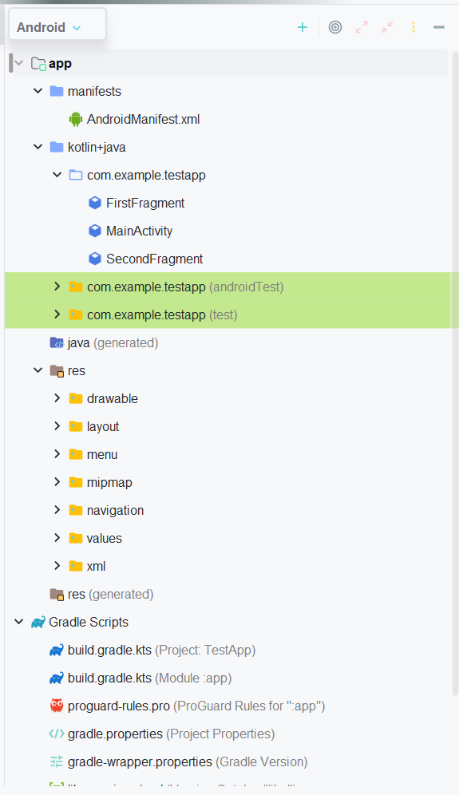

# Buổi 6: Android Overview
- [Buổi 6: Android Overview](#buổi-6-android-overview)
  - [I. Android Overview](#i-android-overview)
    - [a. Hệ điều hành android và Android Studio](#a-hệ-điều-hành-android-và-android-studio)
      - [1. Android:](#1-android)
      - [2. Android Studio:](#2-android-studio)
    - [b. Android folder project structure - Cấu trúc thư mục dự án Android:](#b-android-folder-project-structure---cấu-trúc-thư-mục-dự-án-android)
      - [1. manifests - Thư mục kê khai:](#1-manifests---thư-mục-kê-khai)
      - [2. Thư mục java hoặc kotlin+java:](#2-thư-mục-java-hoặc-kotlinjava)
      - [3. Resource Folder (res) - Thư mục tài nguyên:](#3-resource-folder-res---thư-mục-tài-nguyên)
      - [4. Gradle Scripts:](#4-gradle-scripts)
    - [c. XML](#c-xml)
    - [d. Tool cơ bản có trong Android studio](#d-tool-cơ-bản-có-trong-android-studio)
    - [e. View cơ bản trong Android Studio](#e-view-cơ-bản-trong-android-studio)
  - [II. BasicLayout:](#ii-basiclayout)
    - [Basic layout:](#basic-layout)
      - [1. FrameLayout:](#1-framelayout)
      - [2. LinearLayout:](#2-linearlayout)
      - [3. Realative Layout](#3-realative-layout)
      - [4. TableLayout:](#4-tablelayout)
      - [5. GridLayout:](#5-gridlayout)
      - [6. ConstraintLayout:](#6-constraintlayout)
    - [ViewBinding và cách sử dụng:](#viewbinding-và-cách-sử-dụng)


## I. Android Overview
### a. Hệ điều hành android và Android Studio
#### 1. Android:
- Android là hệ điều hành dựa trên Linux được thiết kế dành cho mobile device có màn hình cảm ứng như điện thoại thông minh và máy tính bảng. Android có mã nguồn mở.
- Ngôn ngữ: Được viết bằng Java, Kotlin (UI), C (nhân), C++ và 1 số ngôn ngữ khác
- Android được phát triển bởi Android Inc. với sự hỗ trợ tài chính từ Google và sau này được chính Google mua lại vào năm 2005.
#### 2. Android Studio:
- Android Studio là IDE chính thức dành cho phát triển nền tảng trên Android.
- Được ra mắt vào ngày 15/03/2013 tại hội nghị Google I/O. Phiên bản ổn định lần đầu được ra mắt vào 12/2024 (p.bản 1.0).
- Được dựa trên phần mềm **Intellij IDEA** của JetBrains. Hỗ trợ các hệ điều hành Windows, Mac OS X và Linux
- Các tính năng nổi bật:
  - Trình giả lập Android (Android Emulator)
  - Build hệ thống với Gradle
  - Công cụ kiểm thử và gỡ lỗi: Logcat, Debugger, Profiler
### b. Android folder project structure - Cấu trúc thư mục dự án Android:
. Cấu hình cơ bản của file:
#### 1. manifests - Thư mục kê khai:
- Chứa file `AndroidManifests.xml`
```xml
<manifest xmlns:android="http://schemas.android.com/apk/res/android"
    package="com.example.myapp">

    <!-- Khai báo quyền sử dụng -->
    <uses-permission android:name="android.permission.INTERNET" />
    <uses-permission android:name="android.permission.CAMERA" />

    <!-- Yêu cầu phiên bản SDK -->
    <uses-sdk
        android:minSdkVersion="21"
        android:targetSdkVersion="33" />

    <application
        android:allowBackup="true"
        android:icon="@mipmap/ic_launcher"
        android:label="@string/app_name"
        android:supportsRtl="true"
        android:theme="@style/Theme.MyApp">

        <!-- Activity khởi động khi mở app -->
        <activity android:name=".MainActivity">
            <intent-filter>
                <action android:name="android.intent.action.MAIN" />
                <category android:name="android.intent.category.LAUNCHER" />
            </intent-filter>
        </activity>

        <!-- Khai báo thêm activity nếu có -->
        <activity android:name=".SecondActivity" />

        <!-- Các service, receiver... nếu có -->
    </application>
</manifest>
```
- Mục đích của manifest:

| Vai trò| Giải thích|
|----| -----|
| **Khai báo app**                     | Định danh tên gói (`package`) và cấu hình ứng dụng.|
| **Khai báo thành phần (components)** | Gồm: `Activity`, `Service`, `BroadcastReceiver`, `ContentProvider`.               |
| **Khai báo quyền (permissions)**     | Quyền như internet, camera, GPS…                                                  |
| **Cấu hình metadata**                | Dành cho cấu hình theme, launcher, thư viện bên ngoài…                            |
| **Chỉ định Intent Filters**          | Xác định các hoạt động nào được khởi chạy từ ngoài (launcher, chia sẻ, mở link…). |

#### 2. Thư mục java hoặc kotlin+java:
- Là thư mục chứa các tệp mã kotlin/java được tạo trong quá trình phát triển ứng dụng. 
- Tự động có 1 file MainActivity.java/kt tự động tạo trong package `com.example.<project name>`

#### 3. Resource Folder (res) - Thư mục tài nguyên:
Thư mục tài nguyên là thư mục quan trọng nhất vì nó chứa tất cả các code không phải mã như hình ảnh, bố cục XML và chuỗi giao diện người dùng cho ứng dụng Android.
- `res/drawable/`: Thư mục dùng để chứa các loại hình ảnh khác nhau để phát triển app. 
- `res/layout/`: Thư mục layout chứa tất cả các tệp layout XML mà chúng ta đã sử dụng để định nghĩa giao diện người dùng cho ứng dụng.
- `res/mipmap/`: Dùng để chứa các biểu tượng ứng dụng **(launcher icons)** với nhiều độ phân giải, giúp Android hiển thị phù hợp trên mọi loại màn hình một cách tối ưu.
- `res/values/`: Thư mục Values chứa một số tệp XML như chuỗi, kích thước, màu sắc và định nghĩa kiểu. Một trong những tệp quan trọng nhất là tệp strings.xml chứa các tài nguyên.


#### 4. Gradle Scripts:
Gradle là hệ thống xây dựng tự động và chứa một số tệp được sử dụng để xác định cấu hình xây dựng có thể áp dụng cho tất cả các module trong ứng dụng.
- Trong `build.gradle (Project)` có các buildscripts
- Trong `build.gradle (Module)`, plugins và implementation được sử dụng để xây dựng các cấu hình có thể áp dụng cho tất cả các module ứng dụng.

### c. XML
- **XML** là từ viết tắt của từ **Extensible Markup Language** là ngôn ngữ đánh dấu mở rộng được thiết kế để lưu trữ và truyền tải dữ liệu một cách có cấu trúc. Tác dụng chính của XML là đơn giản hóa việc chia sẻ dữ liệu giữa các nền tảng và các hệ thống được kết nối thông qua mạng Internet.
- Trong Android, XML được sử dụng để mô tả giao diện người dùng (UI) và các tài nguyên. Thay vì viết bằng Java/Kotlin thuần thì Android khuyến khích nên thiết kế giao diện bằng XML tách biệt để dễ quản lý, dễ bảo trì và hỗ trợ nhiều loại thiết bị.
- Các file XML thường được dùng ở:

| Nơi sử dụng     | Tác dụng                              |
| --------------- | ------------------------------------- |
| `layout/`       | Giao diện màn hình                    |
| `values/`       | Văn bản, màu sắc, kích thước, style   |
| `drawable/`     | Hình vẽ bằng XML (shape, selector...) |
| `manifest/`     | Cấu hình tổng thể ứng dụng            |
| `menu/`         | Khai báo menu                         |
| `anim/`         | Hiệu ứng animation                    |

### d. Tool cơ bản có trong Android studio
- Debugger:
  - Dùng để đặt breakpoint, xem giá trị biến, luồng chạy.
  - Có thể tạm dừng, xem stack trace, bước qua từng dòng code.
- Logcat: 
  - Hiển thị log (ghi chú chạy) của ứng dụng đang chạy trên máy thật hoặc giả lập.
  - Dùng để: Xem Log.d, Log.e... Gỡ lỗi (debug). Tìm crash (Exception).
- Layout inspector: 
  - Dùng để kiểm tra giao diện của người dùng
  - Có thể so sánh bố cục ứng dụng với mô hình thiết kế, hiển thị chế độ xem phóng to hoặc 3D của ứng dụng và kiểm tra chi tiết bố cục tại thời gian chạy.
- Layout Editor: Dùng để thiết kế UI (giao diện) cho các màn hình Activity hoặc Fragment. Có 3 chế độ: Kéo thả, viết XML hoặc cả 2. 
- Emulator: Mô phỏng một thiết bị Android trên máy tính. Có thể tùy chỉnh cấu hình: màn hình, RAM, API level...
- Android Virtual Device (AVD): Đây là trình quản lý các Emulator. Chọn phiên bản Android, độ phân giải, CPU, RAM...
### e. View cơ bản trong Android Studio
- Những gì nhìn thấy trên màn hình thiết bị Android được gọi là `View`. `View` được vẽ trên thiết bị Android với 1 hình chữ nhật.
- Các View cơ bản và thường xuyên sử dụng trong Android như: `TextView`, `EditText`, `ImageView`, `Button`, `CheckBox`, `RadioButton`. Các `View` này đều được kế thừa từ class `View`.
- Cách tạo `View` trong Android:
  - Dùng XML:
  ```xml
  <TextView
        android:id="@+id/tv_Favorites"
        android:layout_width="wrap_content"
        android:layout_height="wrap_content"
        android:text="Yêu Thích"/>
  ```
  - Dùng Java:
  ```java
  TextView tvFavorites = new TextView(this);
  tvFavorites.setText("Yêu thích");
  ```

- Các thuộc tính của View:
<details>

<summary><strong>layout_width & layout_height</strong></summary>

- <strong>layout_width</strong> dùng để quy định chiều cao của View
- <strong>layout_height</strong> dùng để quy định chiều rộng của View.
- Các View khi được khởi tạo bắt buộc phải có 2 yếu tố này
- <strong>match_parent</strong>: Các view sẽ có chiều bằng đúng chiều của phần tử cha của nó
- <strong>wrap_content</strong>: Chiều của view sẽ phụ thuộc vào content của view
- Cách truy cập:
```xml
<TextView
    android:layout_width = "wrap_content"
    android:layout_height = "match_parent">
```

</details>

<details>
<summary> <strong> id </strong></summary>

- Thuộc tính <strong> id </strong> xác định <strong> id </strong> của View, được khai báo ở file định nghĩa giao diện XML và sử dụng lại trong code Java để ánh xạ đối tượng, tìm kiếm các View trong code Java khi cần.
- Trong file XML:
```xml
<TextView
    android:id = "@+id/tv_message"
    android:layout_width = "wrap_content"
    android:layout_height = "match_parent">
```
- Ánh xạ đối tượng Textview trong XML thông qua id trong Java:
```java
TextView tvMessage = (TextView)findViewById(R.id.tv_message);
```
Phương thức `findViewById()` sẽ trả về về `View` cho nên cần ép kiểu về kiểu mong muốn, ở đây là `TextView`.
</details>

<details>
<summary> <strong> background </strong></summary>

Dùng để xác định màu nền của **View**
```xml
<TextView
    android:id = "@+id/tv_message"
    android:layout_width = "wrap_content"
    android:layout_height = "match_parent"
    android:background="#ffffff">
```
</details>

<details>
<summary> <strong> margin & padding </strong></summary>

- `margin`: là khoảng cách từ các cạnh của `View` hiện tại tới các `View` khác.
- `padding`: là khoảng cách từ các cạnh của `View` tới phần nội dung bên trong.

- View chưa set padding & margin:
```xml
<?xml version="1.0" encoding="utf-8"?>
<FrameLayout xmlns:android="http://schemas.android.com/apk/res/android"
    android:layout_width="match_parent"
    android:layout_height="match_parent">

    <TextView
        android:id="@+id/tv_message"
        android:text="Hello Android Studio"
        android:layout_width="wrap_content"
        android:layout_height="wrap_content"
        android:background="#D5BFE4"/>
</FrameLayout>
```

- View sau khi thêm `marginTop` và `marginLeft`:
```xml
<?xml version="1.0" encoding="utf-8"?>
<FrameLayout xmlns:android="http://schemas.android.com/apk/res/android"
    android:layout_width="match_parent"
    android:layout_height="match_parent">

    <TextView
        android:id="@+id/tv_message"
        android:text="Hello Android Studio"
        android:layout_width="wrap_content"
        android:layout_height="wrap_content"
        android:layout_marginTop="50dp"
        android:layout_marginLeft="30dp"
        android:background="#D5BFE4"/>
</FrameLayout>
```

- View sau khi thêm `paddingTop` và `paddingBottom`
```xml
<?xml version="1.0" encoding="utf-8"?>
<FrameLayout xmlns:android="http://schemas.android.com/apk/res/android"
    android:layout_width="match_parent"
    android:layout_height="match_parent">

    <TextView
        android:id="@+id/tv_message"
        android:text="Hello Android Studio"
        android:layout_width="wrap_content"
        android:layout_height="wrap_content"
        android:layout_marginTop="50dp"
        android:layout_marginLeft="30dp"
        android:paddingTop="20dp"
        android:paddingBottom="10dp"
        android:background="#D5BFE4"/>
</FrameLayout>
```
</details>

1 số view cơ bản trong Android:
<details>
<summary><strong>TextView </strong></summary>

`TextView` là `View` dùng để **hiển thị văn bản** (text) lên màn hình. `TextView` được định nghĩa bởi thẻ `<TextView>` trong XML

- Các thuộc tính trong `TextView`:
  - `android:text`: xác định văn bản sẽ hiển thị lên `TextView`.
  - `android:textColor`: xác định màu chữ của TextView.
  - `android:textSize`: xác định kích thước chữ của `TextView`.
  - `android:textStyle`: xác định kiểu chữ `TextView`, có 3 giá trị là `normal` (thông thường), `bold` (in đậm), `ilalic` (nghiêng).
  - `android:background`: xác định màu nền TextView.
  - `android:drawableLeft/drawableRight/drawableTop/drawableBottom`: xác định drawable nằm bên trái/phải/trên/dưới văn bản.
  - `padding, pl`
    ```xml
    <?xml version="1.0" encoding="utf-8"?>
    <FrameLayout xmlns:android="http://schemas.android.com/apk/res/android"
        android:layout_width="match_parent"
        android:layout_height="match_parent">

        <TextView
            android:id="@+id/tv_message"
            android:text="Hello Android Studio"
            android:layout_width="wrap_content"
            android:layout_height="wrap_content"
            android:textColor="@color/white"
            android:textSize="23dp"
            android:textStyle="bold"
            android:drawableLeft="@mipmap/ic_launcher"
            android:background="#D5BFE4"/>
    </FrameLayout>
    ```
</details>


<details>
<summary><strong> EditText </strong></summary>

`EditText` là `View` dùng để lấy giá trị từ người dùng nhập vào. `EditText` được định nghĩa bởi thẻ `<EditText>` trong XML.
- 1 số thuộc tính:
  - `android:hint`: văn bản ẩn dưới text, khi nhập text sẽ mất
  - `android:textColor`: xác định màu của text.
  - `android:textSize`: xác định kích thước của text.
  - `android:textStyle`: xác định kiểu của văn bản gồm các giá trị italic (nghiêng), bold (in đậm), normal (kiểu thường).
  - `android:inputType`: xác định phương thức nhập của `Edittext`. Có các giá trị như sau: text, number, textPassword, phone, textUrl, …
- Để lấy giá trị nhập trong `EditText` trong Java làm như sau:
  - Lấy EditText thông qua id trong file XML.
  - Sử dụng phương thức getText() của EditText để lấy chuỗi.
- XML hiển thị để nhập:
```xml
<?xml version="1.0" encoding="utf-8"?>
<FrameLayout xmlns:android="http://schemas.android.com/apk/res/android"
    android:layout_width="match_parent"
    android:layout_height="match_parent">
    <EditText
        android:id="@+id/edt_message"
        android:hint="Init Value"
        android:layout_width="match_parent"
        android:layout_height="wrap_content" />
</FrameLayout>
```
- Java lấy dữ liệu nhập:
```java
EditText edtMessage = (EditText)findViewById(R.id.edt_message);
String value = edtMessage.getText().toString();
```
</details>


<details>
<summary><strong> Button </strong></summary>

`Button` là `View` dùng để nhận 1 các cú chạm (nhấn nút) và thực hiện các chức năng trong phương thức `onClick()`. `Button` được định nghĩa bởi thẻ `<Button>` trong XML.
```xml
<Button
   android:id="@+id/btn_Click"
   android:text="Click Me"
   android:textStyle="italic"
   android:textColor="@color/colorAccent"
   android:layout_width="wrap_content"
   android:layout_height="wrap_content" />
```
- 1 số thuộc tính:
  - `android:id`: xác định id.
  - `android:text`: xác định văn bản sẽ hiển thị. 
  - `android:textColor`: xác định màu văn bản.
  - `android:background`: xác định màu nền.
- Để thực hiện những khối lệnh khi nhấp chuột vào Button làm như sau:
  - Lấy về đối tượng `Button` thông qua `id` được khai báo ở file XML.
  - Đặt bộ lắng nghe sự kiện cho `Button` thông qua phương thức `setOnClickListener()` và xử lý các công việc trong phương thức `onClick()`.
```kotlin
val btnClick = findViewById<Button>(R.id.btn_click)
btnClick.setOnClickListener {
    // xử lý khi nhấn nút
}
```
</details>


<details>
<summary><strong> ImageView </strong></summary>

`ImageView` là `View` dùng để hiển thị hình ảnh.
- 1 số thuộc tính phổ biến của ImageView:
  - `android:id`: xác định id.
  - `android:src`: xác định nguồn hình ảnh hoặc drawable.
  - `android:scaleType`: kiểu hiển thị hình ảnh của ImageView. Có các giá trị: fitCenter, fitStart, fitEnd, center, centerCrop, centerInside, matrix.
XML
```xml
<ImageView
    android:scaleType="centerCrop"
    android:src="@drawable/keep_calm"
    android:layout_gravity="center_horizontal"
    android:layout_width="wrap_content"
    android:layout_height="wrap_content" />
```

- Để gán hình ảnh động trong Java, sử dụng các phương thức sau:
  - Nếu nguồn là bitmap: void setImageBitmap(Bitmap bm).
  - Nếu nguồn là id của hình ảnh nằm trong thư mục drawable: void setImageResource(@DrawableRes int resId).
  - Nếu nguồn là drawable: void setImageDrawable(@Nullable Drawable drawable).
</details>

## II. BasicLayout:
### Basic layout:
#### 1. FrameLayout:
- Là layout khi gắn các view lên layout thì nó sẽ luôn giữ các view ở phía góc trái màn hình và không cho thay đổi vị trí của chúng
```xml
<FrameLayout xmlns:android="http://schemas.android.com/apk/res/android"
    xmlns:tools="http://schemas.android.com/tools"
    android:layout_width="match_parent"
    android:layout_height="match_parent"
    tools:context=".MainActivity" >


    <TextView
        android:id="@+id/textView"
        android:layout_width="300dp"
        android:layout_height="300dp"
        android:background="@color/colorAccent"
        android:text="TextView" />

    <TextView
        android:id="@+id/textView2"
        android:layout_width="218dp"
        android:layout_height="221dp"
        android:background="@color/colorPrimaryDark" />
</FrameLayout>
```

#### 2. LinearLayout:
- `LinearLayout` sẽ bố trí các view theo dạng khối và không đè lên nhau. `LinearLayout` có hai chiều bố trí bố cục là:
  - `Vertical Orientation` – các view bên trong sẽ được sắp xếp theo chiều dọc
  - `Horizontal Orientation` – Tương tự nhưng theo chiều ngang
```xml
<LinearLayout
    xmlns:android1="http://schemas.android.com/apk/res/android"
    android1:layout_width="match_parent"
    android1:layout_height="match_parent"
    android1:orientation="horizontal" >

    <TextView
        android1:layout_width="80dp"
        android1:layout_height="80dp"
        android1:text="1"
        android1:textColor="#fff"
        android1:textSize="15pt"
        android1:textAlignment="center"
        android1:textStyle="bold"
        android1:background="@color/black" />

    <TextView
        android1:layout_width="80dp"
        android1:layout_height="80dp"
        android1:text="2"
        android1:textColor="#000"
        android1:textSize="15pt"
        android1:textAlignment="center"
        android1:textStyle="bold"
        android1:background="@color/white" />

    <TextView
        android1:layout_width="80dp"
        android1:layout_height="80dp"
        android1:text="3"
        android1:textColor="#fff"
        android1:textSize="15pt"
        android1:textAlignment="center"
        android1:textStyle="bold"
        android1:background="#8c0520" />

    <TextView
        android1:layout_width="80dp"
        android1:layout_height="80dp"
        android1:background="#efcd21"
        android1:text="4"
        android1:textAlignment="center"
        android1:textColor="#fff"
        android1:textSize="15pt"
        android1:textStyle="bold" />
</LinearLayout>
```

#### 3. Realative Layout
- Là loại Layout mà trong đó vị trí của mỗi view con sẽ được xác định so với view khác hoặc so với thành phần cha của chúng thông qua ID. Ta có thể sắp xếp 1 view ở bên trái, bên phải view khác hoặc ở giữa màn hình.
```xml
<RelativeLayout xmlns:android="http://schemas.android.com/apk/res/android"
    android:layout_width="match_parent"
    android:layout_height="match_parent">

    <TextView
        android:layout_width="150dp"
        android:layout_height="50dp"
        android:text="1"
        android:textColor="#fff"
        android:id="@+id/hop1"
        android:textSize="10pt"
        android:textAlignment="center"
        android:background="@color/black" />

    <TextView
        android:layout_width="150dp"
        android:layout_height="50dp"
        android:text="2"
        android:textColor="#000"
        android:id="@+id/hop2"
        android:textSize="10pt"
        android:textAlignment="center"
        android:layout_toRightOf="@+id/hop1"
        android:background="@color/white" />

    <TextView
        android:layout_width="150dp"
        android:layout_height="50dp"
        android:text="3"
        android:textColor="#fff"
        android:id="@+id/hop3"
        android:background="#8e0917"
        android:textSize="10pt"
        android:textAlignment="center"
        android:layout_below="@+id/hop1" />

    <TextView
        android:layout_width="150dp"
        android:layout_height="50dp"
        android:text="4"
        android:textColor="#fff"
        android:id="@+id/hop4"
        android:textSize="10pt"
        android:textAlignment="center"
        android:background="#edcb25"
        android:layout_below="@+id/hop2"
        android:layout_toRightOf="@+id/hop3" />
</RelativeLayout>
```

#### 4. TableLayout:
`TableLayout` sẽ sắp xếp các `View con` bên trong thành dạng bảng. Mỗi hàng là một đối tượng view `TableRow` bên trong `TableRow` chứa các `View con`, mỗi `View con` này nằm ở vị trí một ô bảng (cell). Cột / hàng trong bảng bắt đầu từ số 0.
```xml
<TableLayout android:layout_height="match_parent"
    android:layout_width="match_parent"
    xmlns:android="http://schemas.android.com/apk/res/android">
    <TableRow>
        <TextView
            android:text="TableLayout Example"
            android:background="#c98282"
            android:gravity="center"/>
    </TableRow>

    <TableRow>
        <Button android:text="B1 B1" />
        <Button android:text="B2"/>
    </TableRow>

    <TableRow>
        <Button android:text="C1" />
        <Button android:text="C2" />
        <Button android:text="Cell example" />
    </TableRow>
</TableLayout>
```

#### 5. GridLayout:
`GridLayout` của Android đơn giản chỉ là 1 layout dạng lưới và ta có thể chia các cột và dòng cho cái lưới đó, các view sẽ được dặt vào các ô trong cái lưới này.
```xml
<GridLayout
    xmlns:android1="http://schemas.android.com/apk/res/android"
    android1:layout_width="match_parent"
    android1:layout_height="match_parent"
    android1:columnCount="2"
    android1:rowCount="2"
    >
    <TextView
        android1:layout_width="80dp"
        android1:layout_height="80dp"
        android1:text="1"
        android1:textColor="#fff"
        android1:textSize="15pt"
        android1:textAlignment="center"
        android1:textStyle="bold"
        android1:background="@color/black" />

    <TextView
        android1:layout_width="80dp"
        android1:layout_height="80dp"
        android1:text="2"
        android1:textColor="#000"
        android1:textSize="15pt"
        android1:textAlignment="center"
        android1:textStyle="bold"
        android1:background="@color/white" />

    <TextView
        android1:layout_width="80dp"
        android1:layout_height="80dp"
        android1:text="3"
        android1:textColor="#fff"
        android1:textSize="15pt"
        android1:textAlignment="center"
        android1:textStyle="bold"
        android1:background="#8c0520" />

    <TextView
        android1:layout_width="80dp"
        android1:layout_height="80dp"
        android1:background="#efcd21"
        android1:text="4"
        android1:textAlignment="center"
        android1:textColor="#fff"
        android1:textSize="15pt"
        android1:textStyle="bold" />
</GridLayout>
```

#### 6. ConstraintLayout:
- `ConstraintLayout` là 1 **ViewGroup** với đặc tính Constraint, việc này thể hiện ở các View trong ViewGroup luôn có những kết nối chặt chẽ với nhau. Tức là View này sẽ phụ thuộc View kia để xác định 4 thuộc tính cơ bản: X, Y, width, height.
- Các thuộc tính của ConstraintLayout:
  - `app:layout_constraint<H1>_to<H2>Of`, với H1, H2 bao gồm:
    - H1 có thể là Left, Right, Top, Bottom.
    - H2 có thể là Top hoặc Bottom, khi H1 là Left hoặc Right, H2 có thêm Left, Right.
    - Ý nghĩa: Ràng buộc bên `<H1>` của View hiện tại đến bên `<H2>` của View khác
    - VDU: `app:layout_constraintTop_toEndOf="@+id/view"`
  - `layout_constraintHorizontal_bias` hoặc `layout_constraintVertical_bias`: Định vị View theo trục ngang/dọc của màn hình
### ViewBinding và cách sử dụng:
- Thiết lập:  Vào `build.gradle.kts (Module :App)`. Tạo mới `buildFeatures` và set `viewBinding = true`. Sau đó sync now
- Cách sử dụng:
    - Trong MainActivity class, tạo `private lateinit var binding: <Tên fileXML viết liền, viết hoa chữ cái đầu>Binding>`
    - Sử dụng `inflate(layoutInflater)` để khởi tạo binding
    - Sử dụng `binding.<Tên view>` để truy cập tới view đó, kết hợp với `setOnclickListener()` để thực hiện thao tác với view đó
- Ví dụ
MainActivity.kt
```kotlin
package com.example.testapp

import android.os.Bundle
import androidx.appcompat.app.AppCompatActivity
import com.example.testapp.databinding.ActivityMainBinding

class MainActivity : AppCompatActivity() {
    private lateinit var binding: ActivityMainBinding

    override fun onCreate(savedInstanceState: Bundle?) {
        super.onCreate(savedInstanceState)
        binding = ActivityMainBinding.inflate(layoutInflater)
        setContentView(binding.root)
        binding.edtMessage.setOnClickListener {
            val message = binding.edtMessage.text.toString()
            binding.tvMessage.text = message
        }
    }
}
```

activity_main.xml
```xml
<?xml version="1.0" encoding="utf-8"?>
<androidx.constraintlayout.widget.ConstraintLayout xmlns:android="http://schemas.android.com/apk/res/android"
    xmlns:app="http://schemas.android.com/apk/res-auto"
    android:layout_width="match_parent"
    android:layout_height="match_parent"
    android:fitsSystemWindows="true">

    <EditText
        android:id="@+id/edt_message"
        android:layout_width="0dp"
        android:layout_height="wrap_content"
        android:background="#D5BFE4"
        android:hint="Name"
        android:inputType="textPersonName"
        android:minHeight="48dp"
        android:textColor="#000000"
        android:textSize="32sp"
        android:textStyle="bold"
        android:padding="12dp"
        app:layout_constraintTop_toTopOf="parent"
        app:layout_constraintStart_toStartOf="parent"
        app:layout_constraintEnd_toEndOf="parent"/>

    <TextView
        android:id="@+id/tv_message"
        android:layout_width="0dp"
        android:layout_height="wrap_content"
        android:layout_marginTop="10dp"
        android:background="#D5BFE4"
        android:minHeight="48dp"
        android:textColor="#000000"
        android:textSize="32sp"
        android:textStyle="bold"
        android:padding="12dp"
        app:layout_constraintTop_toBottomOf="@id/edt_message"
        app:layout_constraintStart_toStartOf="parent"
        app:layout_constraintEnd_toEndOf="parent"
        />

</androidx.constraintlayout.widget.ConstraintLayout>
```